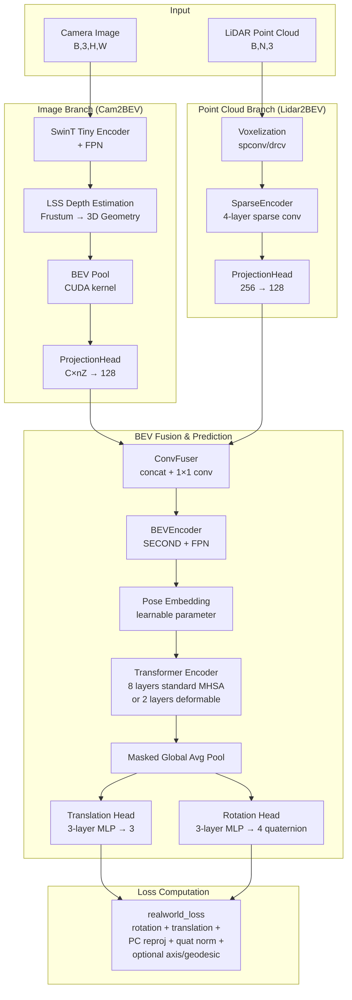
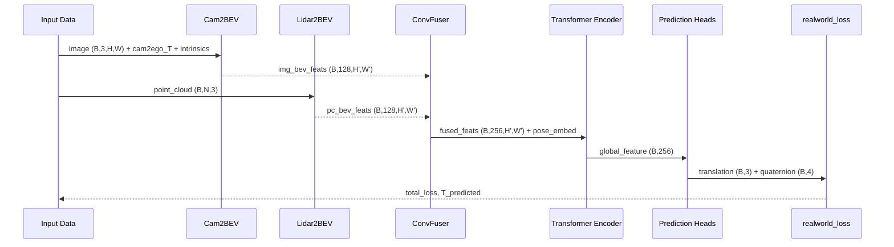
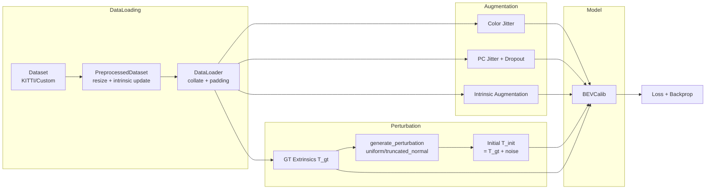

# BEVCalib Architecture Overview

## System Summary

**BEVCalib** is a deep learning system for **LiDAR-Camera extrinsic calibration** via geometry-guided Bird's-Eye View (BEV) representations. Published at **CoRL 2025** ([arXiv:2506.02587](https://arxiv.org/abs/2506.02587)).

Given a camera image and a LiDAR point cloud, BEVCalib predicts the 6-DoF rigid transformation (rotation + translation) that aligns LiDAR to camera. The key idea is to project both modalities into a shared BEV space, fuse them with a Transformer, and regress the calibration residual.

**Tech Stack:**

| Layer | Technology |
|-------|-----------|
| Framework | PyTorch 2.x + CUDA 11.8 |
| Image Backbone | Swin Transformer Tiny (HuggingFace `microsoft/swin-tiny-patch4-window7-224`) |
| Point Cloud Backbone | Sparse Convolution (spconv-cu118 or drcv backend) |
| BEV Projection | LSS (Lift-Splat-Shoot) + custom CUDA BEV Pool (from BEVFusion) |
| Attention | Standard Multi-Head Self-Attention (PyTorch `nn.TransformerEncoder`); Deformable Attention optional via `--deformable 1` (`deformable_attention` library) |
| Training | DDP (multi-GPU/multi-node), AMP (FP16), TensorBoard, wandb |
| Data | KITTI-Odometry, custom ROS bag datasets |
| Language | Python 3.11, CUDA C++ (BEV Pool kernel) |

---

## High-Level Architecture



---

## Project Structure

```
BEVCalib/
├── kitti-bev-calib/              # Core model & training code
│   ├── bev_calib.py              # BEVCalib model (fusion, transformer, prediction heads)
│   ├── train_kitti.py            # Main training script (DDP, AMP, logging)
│   ├── inference_kitti.py        # Inference / evaluation script
│   ├── bev_settings.py           # BEV grid configuration (xbound/ybound/zbound)
│   ├── kitti_dataset.py          # KITTI-Odometry dataset loader
│   ├── custom_dataset.py         # Custom (ROS bag) dataset loader
│   ├── tools.py                  # Perturbation generation utilities
│   ├── visualization.py          # Projection visualization & pose error computation
│   ├── proj_head.py              # ProjectionHead (linear + GELU + residual + LayerNorm)
│   ├── img_branch/               # Image → BEV pipeline
│   │   ├── img_branch.py         # Cam2BEV: SwinT + LSS + BEV Pool
│   │   ├── img_encoders.py       # SwinT Tiny encoder with FPN
│   │   └── bev_pool/             # Custom CUDA BEV pooling operator
│   │       ├── bev_pool.py       # Python wrapper
│   │       ├── setup.py          # CUDA extension build script
│   │       └── src/              # CUDA C++/CU source
│   ├── pc_branch/                # Point Cloud → BEV pipeline
│   │   ├── pc_branch.py          # Lidar2BEV: voxelize + sparse conv + projection
│   │   └── pc_encoders.py        # SparseEncoder (4-layer sparse conv network)
│   ├── losses/                   # Loss functions
│   │   ├── losses.py             # All loss classes (realworld_loss, geodesic, axis, etc.)
│   │   └── quat_tools.py         # Quaternion math utilities
│   └── BEVEncoder/               # Optional post-fusion BEV encoder
│       ├── BEVEncoder.py         # SECOND backbone + SECONDFPN
│       ├── second.py             # SECOND sparse-to-dense backbone
│       └── secondfpn.py          # Feature Pyramid Network for BEV
│
├── configs/                      # YAML training configurations
│   ├── batch8_train_*.yaml       # Batch training experiments (ablation configs)
│   ├── batch16_train_*.yaml      # Large batch experiments
│   ├── eval_generalization_*.yaml
│   ├── drinfer_config_*.yaml     # Deployment inference configs
│   └── README.md                 # Config documentation
│
├── tools/                        # Dataset preparation & validation toolchain
│   ├── preparation/              # ROS bag → KITTI format conversion
│   ├── validation/               # Dataset integrity checks & projection validation
│   ├── visualization/            # Point cloud & projection visualization
│   ├── downloads/                # Trip data download utilities
│   ├── analysis/                 # Perturbation analysis tools
│   └── utils/                    # Debug & fix utilities
│
├── utils/                        # Inference & analysis utilities
│   ├── drinfer_infer.py          # drinfer deployment inference
│   ├── bevcalib_inference.py     # PyTorch checkpoint inference
│   ├── evaluate_extrinsics.py    # Extrinsic evaluation metrics
│   ├── torch2drinfer.py          # PyTorch → drinfer model conversion
│   └── verify_bev_pool.py        # BEV pool CUDA extension verification
│
├── evaluate_checkpoint.py        # Checkpoint evaluation with detailed error reports
├── run_generalization_eval.py    # Cross-dataset generalization testing
│
├── start_training.sh             # Quick-start training launcher
├── train_universal.sh            # Universal training script (scratch/finetune/resume)
├── batch_train.sh                # Config-driven batch training orchestrator
├── stop_training.sh              # Kill running training processes
│
├── Dockerfile/Dockerfile         # Docker environment setup
├── requirements.txt              # Python dependencies
├── ckpt/                         # Pretrained model weights (HuggingFace cache)
└── logs/                         # Training logs, checkpoints, TensorBoard (auto-generated)
```

---

## Key Components

### 1. BEVCalib Model (`kitti-bev-calib/bev_calib.py`)

The central `BEVCalib` class orchestrates the entire pipeline:



**Modes:**
- **Full calibration** (`rotation_only=False`): predicts both rotation (quaternion) and translation (3D vector)
- **Rotation-only** (`rotation_only=True`): predicts rotation only, translation set to zero

### 2. Image Branch (`kitti-bev-calib/img_branch/`)

Converts camera images to BEV features through the **Lift-Splat-Shoot (LSS)** paradigm:

1. **SwinT Tiny Encoder** → multi-scale image features (using HuggingFace pretrained weights)
2. **FPN** → unified feature map at 1/8 resolution
3. **LSS Depth Net** → per-pixel depth distribution + context features
4. **Frustum Construction** → 3D point grid in camera coordinates
5. **Geometry Projection** → transform frustum to ego (LiDAR) coordinates via extrinsics
6. **BEV Pool** (custom CUDA kernel) → scatter-add 3D features onto 2D BEV grid
7. **ProjectionHead** → project C×nZ channels to fixed 128-dim output

The BEV grid resolution is controlled by `bev_settings.py`:
- **X/Y bounds**: spatial coverage in meters
- **Z bound step**: number of height layers (e.g., step=4.0m → 5 layers for [-10,10])

### 3. Point Cloud Branch (`kitti-bev-calib/pc_branch/`)

Converts LiDAR point clouds to BEV features through sparse convolution:

1. **Voxelization** → convert raw points to sparse voxel grid (spconv `PointToVoxel` or drcv backend)
2. **SparseEncoder** → 4-layer sparse 3D convolution network with progressive downsampling
3. **Dense Conversion** → collapse Z-axis into channels, produce dense 2D BEV map
4. **ProjectionHead** → project to 128-dim output

### 4. Fusion & Prediction (`kitti-bev-calib/bev_calib.py`)

After both branches produce 128-channel BEV features:

1. **ConvFuser**: concatenate (256 channels) → 1×1 conv → BN → ReLU
2. **BEVEncoder** (optional): SECOND backbone + FPN for additional spatial reasoning
3. **Pose Embedding**: learnable spatial position encoding added to BEV features
4. **Transformer**: two modes controlled by `--deformable` flag (default off):
   - **Standard mode** (default, `deformable=False`): `nn.TransformerEncoder` with `num_layers×4` (8) layers of standard Multi-Head Self-Attention, GELU activation, pre-norm, with masking on valid BEV regions
   - **Deformable mode** (`--deformable 1`): 2 layers of Deformable Attention (lucidrains `deformable_attention` library, based on "Vision Transformer with Deformable Attention") with stochastic depth
5. **Masked Global Average Pool**: aggregate spatial features using BEV validity mask
6. **Prediction Heads**: two independent 3-layer MLP heads
   - Translation: `Linear(256→128) → LayerNorm → GELU → Dropout → Linear(128→128) → ... → Linear(128→3)`
   - Rotation: same architecture → `Linear(128→4)` (quaternion output)

### 5. Loss Functions (`kitti-bev-calib/losses/`)

The composite `realworld_loss` combines multiple objectives:

| Loss Component | Weight | Description |
|---------------|--------|-------------|
| `rotation_loss` | 0.5 (1.0 rot-only) | Quaternion angular distance (radians) |
| `geodesic_loss` | (alternative) | SO(3) geodesic distance: arccos((tr(R^T R_gt)-1)/2) |
| `translation_loss` | 1.0 (0 rot-only) | SmoothL1 on 3D translation |
| `PC_reproj_loss` | 0.5 (1.0 rot-only) | Point cloud reprojection error |
| `quat_norm_loss` | 0.5 | Quaternion unit-norm regularization |
| `axis_rotation_loss` | 0.3 (optional) | Weighted per-axis (Roll/Pitch/Yaw) Euler angle error |

**Residual formulation**: The network predicts a residual transform `T_pred`. The final calibration is computed as `T_gt_expected = inv(T_pred) * T_init`, where `T_init` is the perturbed initial extrinsics.

---

## Data Flow

### Training Data Pipeline



### Coordinate Systems

- **LiDAR frame** (ego): X=Forward, Y=Left, Z=Up
- **Camera frame**: X=Right, Y=Down, Z=Forward
- **BEV grid**: X-axis and Y-axis aligned with LiDAR frame, Z collapsed
- **Extrinsics `T_to_camera`**: 4×4 rigid transform from LiDAR to camera

---

## Configuration System

### BEV Settings (`bev_settings.py`)

Controls the BEV grid resolution via environment variables or direct config:

| Parameter | KITTI Default | Custom Default | Description |
|-----------|-------------|---------------|-------------|
| `xbound` | (-90, 90, 2.0) | (0, 200, 2.0) | X range and step (meters) |
| `ybound` | (-90, 90, 2.0) | (-100, 100, 2.0) | Y range and step (meters) |
| `zbound` | (-10, 10, 20.0) | (-10, 10, 4.0) | Z range and step (height layers) |
| `sparse_shape` | (720, 720, 41) | auto-computed | Point cloud voxel grid shape |

Environment variables: `BEV_DATASET_TYPE`, `BEV_XBOUND_MIN/MAX`, `BEV_YBOUND_MIN/MAX`, `BEV_XY_STEP`, `BEV_ZBOUND_STEP`.

### Training Configs (`configs/*.yaml`)

YAML-driven batch training with `defaults` inheritance:

```yaml
defaults:
  params:
    batch_size: 8
    learning_rate: 1e-4
    rotation_only: true
    ...

experiments:
  - name: "v6_baseline"
    dataset: "B26A"
    version: "v6_baseline"
    params: {}                   # inherits all defaults

  - name: "v6_geodesic"
    dataset: "B26A"
    version: "v6_geodesic"
    params:
      use_geodesic_loss: 1       # overrides only this param
```

---

## Training Infrastructure

### DDP (Distributed Data Parallel)

- Auto-detected via `RANK`/`WORLD_SIZE`/`LOCAL_RANK` environment variables (torchrun)
- Multi-node support with SLURM integration (`configs/run_batch_train.slurm`)
- `DistributedSampler` for data sharding, per-rank seed for augmentation diversity
- Rank-0 handles all logging, checkpointing, and visualization

### AMP (Automatic Mixed Precision)

- FP16 forward + backward via `torch.cuda.amp.autocast`
- `GradScaler` for stable FP16 gradient scaling
- Critical operations (matrix inversion, loss computation) use explicit `float32`

### Checkpointing

Saves to `logs/<dataset>/<model_dir>/checkpoint/`:
- `ckpt_<epoch>.pth`: periodic checkpoints (model, optimizer, args, errors)
- `ckpt_best_val.pth`: best validation model
- `ckpt_<epoch>_eval/`: per-checkpoint evaluation with projection visualizations and `extrinsics_and_errors.txt`

### Training Scripts

| Script | Purpose |
|--------|---------|
| `start_training.sh` | Quick-start: `bash start_training.sh B26A v1 [--ddp] [--lr 1e-4]` |
| `batch_train.sh` | Config-driven: `bash batch_train.sh configs/my_experiments.yaml` |
| `train_universal.sh` | Advanced: scratch/finetune/resume modes with full parameter control |
| `stop_training.sh` | Kill all running training processes |

---

## How-To Guides

### Add a New Loss Function

1. Define the loss class in `kitti-bev-calib/losses/losses.py`
2. Add it as a member in `realworld_loss.__init__()`
3. Compute it in `realworld_loss.forward()` and add to `loss` sum
4. Add the value to the `ret` dictionary for logging
5. Add CLI argument in `train_kitti.py:parse_args()` if needed

### Add a New Data Augmentation

1. Define the augmentation function in `train_kitti.py` (see `_apply_color_jitter`, `_augment_intrinsics`)
2. Add CLI argument: `parser.add_argument("--augment_new", ...)`
3. Apply in the training loop between data loading and model forward
4. Ensure augmentation works with AMP (use `float32` if numerically sensitive)

### Change the BEV Grid Resolution

1. Set environment variables before training:
   ```bash
   export BEV_XBOUND_MIN=0 BEV_XBOUND_MAX=100 BEV_YBOUND_MIN=-50 BEV_YBOUND_MAX=50
   export BEV_XY_STEP=1.0 BEV_ZBOUND_STEP=2.0
   ```
2. Or modify `bev_settings.py` directly
3. `sparse_shape` for PC branch auto-computes from bounds (0.25m voxel, 41 Z layers)

### Train on a New Custom Dataset

1. Prepare data: `python tools/preparation/prepare_custom_dataset.py --bag_dir /path/to/bags --output_dir ./data/new_dataset`
2. Validate: `python tools/validation/validate_dataset.py --dataset_root ./data/new_dataset`
3. Train: `CUSTOM_DATASET=./data/new_dataset bash start_training.sh custom v1`

### Switch Point Cloud Backend (spconv → drcv)

1. Set environment variable: `export USE_DRCV_BACKEND=1`
2. Ensure `drcv` package is installed
3. Run cross-backend verification: `python kitti-bev-calib/pc_branch/pc_branch.py`

### Evaluate a Checkpoint on Unseen Data

```bash
python evaluate_checkpoint.py \
    --ckpt_path logs/.../ckpt_400.pth \
    --dataset_root /path/to/unseen_data \
    --output_dir /path/to/eval_output \
    --use_full_dataset \
    --angle_range_deg 5.0 --trans_range 0.3
```

### Export Model for Deployment

```bash
python utils/torch2drinfer.py \
    --ckpt_path logs/.../ckpt_best_val.pth \
    --output_path ./exported_model
```

---

## Key Files Reference

| File | Purpose | Modify For |
|------|---------|-----------|
| `kitti-bev-calib/bev_calib.py` | Model architecture | Network topology, heads, fusion strategy |
| `kitti-bev-calib/bev_settings.py` | BEV grid config | Spatial range, resolution, voxel size |
| `kitti-bev-calib/train_kitti.py` | Training loop | Optimizer, scheduler, augmentation, logging |
| `kitti-bev-calib/losses/losses.py` | Loss functions | Loss formulation, weights, new objectives |
| `kitti-bev-calib/img_branch/img_branch.py` | Image → BEV | Image backbone, LSS, depth estimation |
| `kitti-bev-calib/pc_branch/pc_branch.py` | PC → BEV | Voxelization, sparse encoder |
| `kitti-bev-calib/proj_head.py` | Feature projection | Embedding dimension mapping |
| `kitti-bev-calib/visualization.py` | Training visualization | Projection overlay, error metrics |
| `configs/*.yaml` | Experiment configs | Hyperparameters, ablation settings |
| `evaluate_checkpoint.py` | Evaluation pipeline | Eval metrics, output format |
| `tools/preparation/prepare_custom_dataset.py` | Data preparation | ROS bag parsing, format conversion |
| `requirements.txt` | Dependencies | Add new packages |

---

## Dependencies

### Critical

| Package | Version | Purpose |
|---------|---------|---------|
| `torch` | 2.0.1 | Deep learning framework |
| `spconv-cu118` | 2.3.8 | Sparse 3D convolution for point cloud |
| `transformers` | 4.29.1 | SwinT pretrained backbone |
| `deformable_attention` | 0.0.20 | Deformable attention layers (optional, enabled via `--deformable 1`) |

### Key Libraries

| Package | Purpose |
|---------|---------|
| `open3d` | Point cloud processing and visualization |
| `pykitti` | KITTI dataset I/O |
| `opencv_python` | Image processing |
| `scipy` | Spatial transforms and rotations |
| `tensorboard` | Training metrics visualization |
| `rosbags` | Custom dataset preparation from ROS bags |
| `matplotlib` | Analysis plots and charts |

### CUDA Extensions

- `bev_pool`: Custom CUDA kernel for BEV pooling (built via `setup.py build_ext --inplace`)
- Requires `cuda-toolkit=11.8`

---

## Troubleshooting

**BEV pool build fails**
- Ensure `cuda-toolkit=11.8` is installed: `conda install -c "nvidia/label/cuda-11.8.0" cuda-toolkit`
- Build: `cd kitti-bev-calib/img_branch/bev_pool && python setup.py build_ext --inplace`

**spconv import error**
- Use exact version: `pip install spconv-cu118==2.3.8`
- Or switch to drcv backend: `export USE_DRCV_BACKEND=1`

**Out of memory during training**
- Reduce batch size: `--batch_size 4`
- Reduce BEV grid resolution: `export BEV_XY_STEP=4.0`
- Enable DDP to distribute across GPUs: `--ddp`

**Poor calibration accuracy**
- Check BEV settings match your sensor range (especially Z bounds)
- Verify dataset quality with `python tools/validation/validate_dataset.py`
- Try rotation-only mode first: `--rotation_only 1`
- Use geodesic loss: `--use_geodesic_loss 1`

**NaN in training loss**
- AMP may cause instability — critical ops already use `float32` guards
- Reduce learning rate: `--lr 5e-5`
- Check data: ensure no corrupt images or zero-point clouds

---

## Additional Resources

- **Paper**: [arXiv:2506.02587](https://arxiv.org/abs/2506.02587)
- **Training Guide**: [TRAINING_GUIDE.md](TRAINING_GUIDE.md)
- **Analysis Guide**: [utils/ANALYSIS_GUIDE.md](utils/ANALYSIS_GUIDE.md)
- **Custom Dataset**: [tools/preparation/README.md](tools/preparation/README.md)
- **Config System**: [configs/README.md](configs/README.md)
