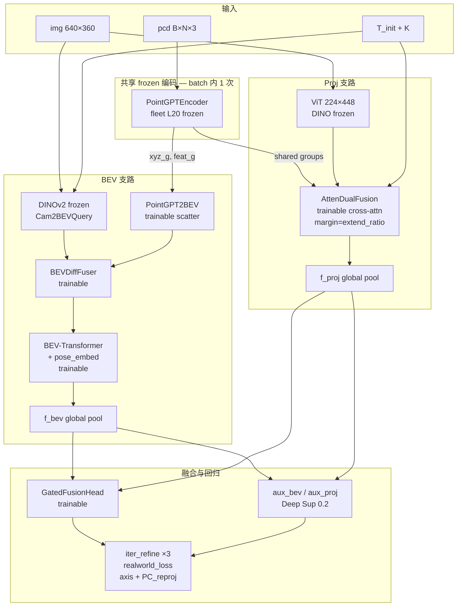
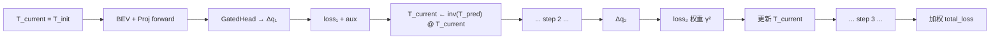

# V39 实验设计：BEVCalib × ProjFusion 架构融合（详细版 v3）

> **状态**：精简方案已确认（2026-05-27）  
> **前置**：`docs/V37_GENERALIZATION_REPORT.md`（shortcut 已解决，MEDW 未解决）  
> **v38**：暂停  
> **推荐配置**：`configs/v39_minimal.yaml`（400ep，1 主实验 + 1 fine-tune）

---

## 0. 精简实验方案（推荐，省 GPU）

> 完整 F0–F7 ablation 矩阵见 §4（可选，默认不跑）。

| 步骤 | ID | 动作 | GPU 成本 |
|------|-----|------|----------|
| 0 | **B0** | eval v36 ckpt（`run_v39_phase0_eval.sh`） | 0 |
| 1 | **M1** | HTCN 快速验证：f1000 × 400ep × LR 4e-4（`v39_minimal.yaml`） | 1× 全量 |
| 2 | **M2a** | M1 best **MEDW** ckpt → ±5° 50ep fine-tune | 0.125× 全量 |

**Gate（训后 `test_data_v2` MEDW200，勿与训练内 val-MEDW 硬比）**：
```
run_post_v39_medw.sh → MEDW(M1) < 0.413°   → 优于 v36
run_post_v39_medw.sh → MEDW(M1) < 0.35°    → Gate PASS
训练内 Jacobian > 0.85                      → shortcut guard
```

> **训练内 MEDW**：rank0 在 **val 划分**上复用 val forward 统计 MEDW200（零额外推理），用于 **趋势监控 + ckpt_best_medw.pth**；绝对数值与 v36/v37 的 `test_data_v2` 结果不可直接对比。正式 Gate 与 v36 **0.413°** 对比必须跑 `tools/run_post_v39_medw.sh`。

**M1 失败后的诊断（按需，非预跑）**：
- 改 BEV → 单训 F1（PointGPT2BEV only）
- 改 Proj → 单训 F2（AttenDualFusion only）

**启动命令**：
```bash
# Baseline eval
bash tools/run_v39_phase0_eval.sh

# 主实验
bash batch_train.sh configs/v39_minimal.yaml

# 训练中 rank0 每 eval_epoches 在 val 上 inline MEDW200（复用 forward）→ ckpt_best_medw.pth
# 训后正式 Gate / 与 v36 对比（test_data_v2）：
bash tools/run_post_v39_medw.sh \
  logs/all_training_data/v39_M1_htcn_main_f1000/all_training_data_scratch/checkpoint
```

---

## 1. 核心问题与目标

### 1.1 已解决 vs 待解决

| 能力 | v37 状态 | v39 目标 |
|------|----------|----------|
| Shortcut（Jacobian ±10°） | ✅ J≈0.88 ADAPTIVE | Guard：不退化 (>0.85) |
| 单帧精度 | ✅ 0.84° | < 0.75° |
| **MEDW200 泛化** | ❌ 0.46–0.49°（v36 仍 0.413°） | **< 0.35°**（stretch 0.28°） |
| Seq00 Roll @ MEDW200 | ❌ 0.82–0.92° | < 0.18° |

### 1.2 v39 设计原则

1. **Shortcut 已不是优化方向** — 不在 NativeCross 上继续堆层
2. **MEDW 是主 KPI** — 训练内 val-MEDW 选 ckpt；正式 Gate 用训后 `test_data_v2` MEDW200
3. **架构融合而非单路径替换** — BEV 全局稳定 + Proj 投影精度 + PointGPT 点云表征
4. **分模块 ablation** — 图像 lifting / 点云编码 / 跨模态融合 / 回归头 四维正交实验

---

## 2. v20 LSS 与 PointGPT：能否替换？（关键澄清）

### 2.1 三者所在层级不同

```
                    图像支路                          点云支路
v20 典型:     Cam2BEV(LSS 深度估计)          →    Lidar2BEV(Spconv 体素)
v31+:         Cam2BEVQuery(无深度)           →    Lidar2BEV(Spconv)  [仍保留]
v36/v37 NC:   DINO patches [bypass BEV]      →    PointGPT groups [NativeCross]
ProjFusion:   ViT 224×448                   →    PointGPT groups [AttenDualFusion]
```

| 模块 | 输入 | 机制 | 泛化瓶颈 |
|------|------|------|----------|
| **LSS** | 图像 | 显式深度估计 → lift-splat 到 BEV | **深度域偏差**（相机高度/角度不同 → 深度分布漂移） |
| **Cam2BEVQuery** | 图像 + 相机参数 | BEV query deformable cross-attn，**无显式深度** | 已替代 LSS（v31+），泛化优于 LSS |
| **Lidar2BEV (Spconv)** | 点云 xyz | 硬体素化 + SparseEncoder | 前向稀疏点云 → 体素密度域偏差；几何表征弱 |
| **PointGPT** | 点云 xyz | FPS groups + Transformer 预训练特征 | 需 **fleet L20** 域匹配；在 cross-attn 中已验证 shortcut 克服 |

### 2.2 直接回答：「LSS 换 PointGPT 能否提升泛化？」

**不能一一替换。** LSS 属于 **图像→BEV lifting**，PointGPT 属于 **点云语义编码**，模态不同。

**正确的 v20→v39 升级路径是两步替换 + 一路融合：**

| v20 瓶颈 | v39 替换 | 预期收益 |
|----------|----------|----------|
| LSS 深度域偏差 | → **Cam2BEVQuery**（v31 已引入，v39 BEV 支路强制 `cam2bev_mode=query`） | 消除深度估计域敏感，Pitch 文档预估 **15–25%** 泛化改善 |
| Spconv 弱表征 + 前向稀疏 | → **PointGPT2BEV**（v39 新模块，见 §3.2） | 与 ProjFusion 共享 fleet L20 预训练，提升点云侧泛化 |
| BEV 与投影特征割裂 | → **HDCN 双分支融合**（BEV 支路 + AttenDualFusion 支路） | 降帧间 variance，主攻 MEDW |

**结论**：PointGPT 不应替换 LSS，而应：
1. 图像侧用 **Query 替换 LSS**（已完成，v39 固化）
2. 点云侧用 **PointGPT 替换/增强 Spconv**（v39 新做 `PointGPT2BEV`）
3. 全局用 **AttenDualFusion 与 BEV 路径融合**（HDCN）

---

## 3. V39 统一架构：HybridTripleCalibNet（HTCN）

在 v2 HDCN 基础上，将 BEV 支路的点云编码升级为 **PointGPT2BEV**，形成 **三路特征 → 融合头**。

### 3.1 总体数据流

#### 3.1.1 ASCII 总览（模块级）

```
┌─────────────────────────────────────────────────────────────────────────────┐
│                        HTCN  (fusion_backend=hybrid_triple)                  │
├─────────────────────────────────────────────────────────────────────────────┤
│                                                                              │
│  img 640×360 ──► DINO(frozen) ──► Cam2BEVQuery ──► cam_bev  (B×C×H×W)      │
│                                                                              │
│  pcd ──► PointGPT-L20(frozen, 单次 forward) ──► groups (B×G×D)              │
│                    ├─► PointGPT2BEV(trainable) ──► pc_bev (B×C×H×W)         │
│                    └─► AttenDualFusion 点侧特征 (shared, 不再二次 extraction)  │
│                                                                              │
│  cam_bev + pc_bev ──► BEVDiffFuser ──► BEV-Transformer pool ──► f_bev     │
│                                                                              │
│  img 224×448 ──► ViT(frozen) ──┐                                             │
│  shared groups + T_init, K ────┼──► AttenDualFusion(trainable) ──► f_proj     │
│                                                                              │
│  f_bev + f_proj ──► GatedFusionHead(trainable) ──► MLP ──► Δq                │
│  iter_refine=0 (M1 训练单步);  loss: axis + PC_reproj + deep_sup(aux_bev/aux_proj)       │
└─────────────────────────────────────────────────────────────────────────────┘
```

#### 3.1.2 Mermaid 数据流（实现级，含 frozen/trainable）



#### 3.1.3 iter_refine 循环（**M1 训练 iter=0**；推理迭代待补）



> **注意**：每步 refine 仍重跑 DINO（BEV）和 ViT（Proj），仅 PointGPT 在循环外算一次。

#### 3.1.4 LR 分组（`v39_minimal.yaml`）

| 参数组 | 模块 | LR |
|--------|------|-----|
| backbone | `img_branch` DINO（frozen，实际 0 grad） | 0 |
| bev_branch | `conv_fuser`, `transformer`, `bev_encoder`, `pose_embed`, `pc_branch` | `lr × 0.25` = 1e-4 |
| head | `proj_branch`, `fusion_head`, `aux_*` | `lr` = 4e-4 |

**共享 PointGPT**：BEV 与 Proj 在 `hybrid_triple` 下 **同一 forward、同一份权重**（`shared_pointgpt=True`）。Proj 初始化 **skip 加载 PointGPT**（`skip_pointgpt=True`），仅 BEV 侧 `PointGPTEncoder` 持有权重；Proj 支路 **ViT 仍独立**（双 ViT，显存未减半）。

**Proj margin**：`native_cross_extend_ratio`（v39 默认 2.5）→ `ProjFusionBranch.margin`。

### 3.2 新模块：PointGPT2BEV

**动机**：v36 BEV 路径 MEDW 0.413° 用的是 Spconv；v37 NativeCross 用 PointGPT 改善了 shortcut/单帧但 bypass 了 BEV。v39 在 BEV 路径 **保留 BEV 融合优势**，同时 **用 PointGPT 替换 Spconv 弱表征**。

```python
class PointGPT2BEV(nn.Module):
    """Scatter PointGPT group features to BEV grid (替代 Lidar2BEV Spconv)."""

    def forward(self, xyz_groups, feat_groups, bev_bounds):
        # xyz_groups: (B, G, 3) ego frame
        # feat_groups: (B, G, D) from PointGPTEncoder
        # 1. 将 group center xy 映射到 BEV cell index
        # 2. scatter_mean / scatter_max 聚合到 (B, D, H_bev, W_bev)
        # 3. ProjectionHead 对齐通道 → out_channels (与 cam_bev 匹配)
        return pc_bev  # (B, C, H, W)
```

| 对比 | Lidar2BEV (Spconv) | PointGPT2BEV |
|------|-------------------|--------------|
| 输入 | 原始点 xyz | PointGPT group xyz + 384-d 语义特征 |
| 归纳偏置 | 局部体素卷积 | 预训练全局/局部几何 |
| 前向稀疏 | 大量空体素 | FPS groups 覆盖前方扇区 |
| 与 Proj 支路 | 独立编码，特征不对齐 | **共享 PointGPT**，特征一致 |
| 泛化 | v36 MEDW 基线 | 预期 fleet L20 域匹配 ↑ |

**实现位置**：`kitti-bev-calib/pc_branch/pointgpt2bev.py`；`bev_calib.py` 增加 `pc_encoder_mode: spconv | pointgpt2bev`。

### 3.3 Fusion Head 变体（融合层 ablation）

| 代号 | 类名 | 机制 | 针对问题 |
|------|------|------|----------|
| **F1** | `GatedFusionHead` | σ(W·[f_bev;f_proj]) 加权 | 通用，主实验 |
| **F2** | `CascadeFusionHead` | Proj Δq₁ → 更新 T → BEV Δq₂ | seq00 大角度 + 序列稳定 |
| **F3** | `CrossAttnFusionHead` | f_bev query × Proj cross tokens | 显式对齐全局/局部 |
| **F4** | `ResidualSO3Head` | Δq = Δq_proj ⊕ Δq_bev | 可解释 baseline |

### 3.4 训练配方

**M1 快速验证**（`configs/v39_minimal.yaml`，当前推荐）：

```yaml
fusion_backend: hybrid_triple
pc_encoder_mode: pointgpt2bev
fusion_variant: gated
cam2bev_mode: query
native_cross: 0

learning_rate: 4.0e-4          # global BS=128 (16×8)，对齐 v37 量级偏保守
backbone_lr_scale: 0.0         # DINO frozen
bev_branch_lr_scale: 0.25      # BEV trainable → 1e-4
iterative_refine: 0            # 训练单步（iter=3 会 3× 重跑 DINO+ViT）
deep_supervision_weight: 0.2
native_cross_extend_ratio: 2.5 # → ProjFusion margin

angle_range_deg: 5             # 对齐 MEDW eval ±5° 与 v36 最佳
max_frames_per_seq: 1000       # 快速验证；正式 Gate 可升到 4000
batch_size: 16                 # 双 ViT + 共享 PointGPT，防 OOM
num_epochs: 400
eval_epoches: 40               # val + inline val-MEDW200（10 次/400ep，复用 forward）
enable_medw_eval: 1            # val 划分 MEDW，维护 ckpt_best_medw.pth（非 test_data_v2）
save_ckpt_per_epoches: 50

# v37 泛化增强（已写入 yaml）
augment_mount_jitter_prob: 0.5
augment_pitch_flip_prob: 0.20
augment_color_jitter: 0.15
# ...

# ckpt：训练中 ckpt_best_medw.pth（MEDW 选）；ckpt_best_val 仅看收敛（不用 val 交付）
```

**全量 Gate 阶段**（M1 通过后）：将 `max_frames_per_seq` 升至 **4000**，其余 recipe 可保持不变。

---

## 4. 多组架构融合实验矩阵（可选，完整 ablation）

> ⚠️ **默认不跑**。资源有限时仅用 §0 精简方案。本节保留供论文级归因。

### 4.1 实验分组逻辑

```
Phase-0  Baseline 复现          →  锚定已有 numbers
Phase-1  单模块替换 ablation    →  量化 LSS/Spconv/PointGPT 各自贡献
Phase-2  双分支融合 ablation    →  量化 BEV×Proj 融合增益
Phase-3  主实验 + fine-tune     →  Gate 判定与交付
```

### 4.2 Phase-0：Baseline 锚定（不训练，仅 eval）

| ID | 名称 | 架构 | 预期 MEDW200 | 用途 |
|----|------|------|-------------|------|
| **B0** | v36 Ep191 | Query + Spconv + Linear head | **0.413°** | MEDW 历史最佳 |
| **B1** | v37 Ep241 | NativeCross + KITTI PointGPT | 0.457° | MEDW v37 最佳 |
| **B2** | v37 Ep350 | NativeCross Ep350 | 0.493° | val/MEDW 背离反例 |
| **B3** | ProjFusion fleet L20 | AttenDualFusion only | 待测 | Proj 上限 |

### 4.3 Phase-1：单模块替换（控制变量）

固定：HDCN 关闭，单路径 BEV 或 Proj；±10° 150ep；MEDW gate。

#### 1A. 图像 lifting 对比（点云固定 Spconv）

| ID | cam2bev_mode | pc_encoder | 验证假设 |
|----|--------------|------------|----------|
| **E1A** | `lss` | spconv | v20 旧方案，预期 MEDW 最差 |
| **E1B** | `query` | spconv | v36 等价，MEDW 基线 |
| **E1C** | `query` | pointgpt2bev | **仅换点云编码**，隔离 PointGPT2BEV 收益 |

#### 1B. 点云编码对比（图像固定 Query）

| ID | pc_encoder | PointGPT ckpt | 验证假设 |
|----|------------|---------------|----------|
| **E2A** | spconv | — | v36 点云侧 |
| **E2B** | pointgpt2bev | kitti_tiny | 域不匹配，预期 < fleet |
| **E2C** | pointgpt2bev | **fleet_L20** | **v39 点云侧主配置** |

#### 1C. Proj 支路单独（无 BEV）

| ID | 架构 | 验证假设 |
|----|------|----------|
| **E3A** | NativeCross 3-layer + fleet L20 | NativeCross 增强上限 |
| **E3B** | AttenDualFusion + fleet L20 | ProjFusion 在 BEVCalib 数据上的上限 |
| **E3C** | AttenDualFusion + iter3 + MLP[128,128] | 完整 Proj 配方 |

**Phase-1 决策树**：
- 若 E1C/E2C > E1B/E2A 在 MEDW → PointGPT2BEV 有效，进入 Phase-2 全 HTCN
- 若 E3B > E1B → Proj 支路独立强于 BEV，融合必要性成立
- 若 E1A >> E1B → 再次确认 Query 替换 LSS 的必要性（文档性验证）

### 4.4 Phase-2：双/三分支融合 ablation

固定：Query + fleet PointGPT；±10° 150ep。

| ID | BEV 支路 | Proj 支路 | Fusion | 配置文件 |
|----|----------|-----------|--------|----------|
| **F0** | Query+Spconv | — | — | `v39_bev_spconv_only.yaml` |
| **F1** | Query+PointGPT2BEV | — | — | `v39_bev_pointgpt_only.yaml` |
| **F2** | — | AttenDualFusion | — | `v39_proj_only.yaml` |
| **F3** | Query+Spconv | AttenDualFusion | **F1 Gated** | `v39_hdcn_gated_spconv.yaml` |
| **F4** | Query+PointGPT2BEV | AttenDualFusion | **F1 Gated** | **`v39_hdcn_gated.yaml` ★主实验** |
| **F5** | Query+PointGPT2BEV | AttenDualFusion | F2 Cascade | `v39_hdcn_cascade.yaml` |
| **F6** | Query+PointGPT2BEV | AttenDualFusion | F3 CrossAttn | `v39_hdcn_xattn.yaml` |
| **F7** | Query+PointGPT2BEV | AttenDualFusion | F4 ResidualSO3 | `v39_hdcn_residual.yaml` |

**融合增益判定**（必须同时满足）：
```
MEDW(F4) < min(MEDW(F1), MEDW(F2)) - 0.02°
Jacobian(F4) > 0.85
MEDW(F4) < 0.35°  → Gate PASS
```

### 4.5 Phase-3：主实验交付链

| ID | 描述 | 参数 |
|----|------|------|
| **P3-A** | F4 全量训练 | 4000 frames, 150ep, ±10° |
| **P3-B** | P3-A best MEDW ckpt → ±5° fine-tune | 50ep, LR 5e-5 |
| **P3-C** | P3-B + seq00 oversample / Roll axis_weight×2 | 针对 Roll 瓶颈 |
| **P3-D** | P3-A 最优 fusion 变体（F5/F6 若优于 F4） | 替换 F4 |

---

## 5. 实现规划

### 5.1 新增文件

```
kitti-bev-calib/
  pc_branch/pointgpt2bev.py       # PointGPT group → BEV scatter
  hybrid_triple_calib.py          # HTCN 主 forward
  projfusion_adapter.py           # AttenDualFusion 封装
  fusion_heads.py                 # F1–F4 FusionHead
bev_calib.py                      # fusion_backend enum
configs/
  v39_phase0_baselines.yaml       # eval only
  v39_phase1_single_module.yaml   # E1–E3 arms
  v39_phase2_fusion.yaml          # F0–F7 arms
  v39_phase3_main.yaml            # P3 chain
tools/
  eval_projfusion_medw.py         # B3 baseline
  run_v39_medw_matrix.sh          # 批量 MEDW eval
```

### 5.2 `bev_calib.py` 后端枚举

```python
# fusion_backend 选项
NATIVE_CROSS   = "native_cross"    # v37 路径（ablation only）
BEV_ONLY       = "bev_only"        # Phase-1 F0/F1
PROJ_ONLY      = "proj_only"       # Phase-1 F2/E3
HYBRID_DUAL    = "hybrid_dual"     # BEV(Spconv) + Proj
HYBRID_TRIPLE  = "hybrid_triple"   # BEV(PointGPT2BEV) + Proj  ★默认
```

### 5.3 显存预算（L20 48GB）

| 配置 | BS/GPU | 预估显存 | 备注 |
|------|--------|----------|------|
| BEV only (Query+Spconv) | 64 | ~28GB | v36 等价 |
| Proj only | 48 | ~32GB | ViT+PointGPT cache |
| **HTCN F4** | **32–48** | **~38–44GB** | 共享 PointGPT cache |
| HTCN + grad_accum 2 | 24×2 | ~36GB | OOM fallback |

### 5.4 优先级与排期

| 优先级 | 任务 | 工期 | 依赖 |
|--------|------|------|------|
| **P0** | PointGPT2BEV + smoke test | 3d | fleet L20 ckpt |
| **P0** | projfusion_adapter + shared encoder cache | 3d | PROJFUSION_ROOT |
| **P1** | Phase-0 baseline eval（B0–B3） | 1d | — |
| **P1** | Phase-1 E1A–E2C 快速训练（50ep quick） | 5d | P0 |
| **P2** | Phase-2 F0–F7 全量 150ep | 10d | P1 决策 |
| **P3** | F4 主实验 + P3-B ±5° fine-tune | 7d | F4 Gate PASS |

---

## 6. 预期结果与合理性

### 6.1 各模块预期贡献（估算）

| 改动 | 相对 MEDW 0.457° (v37) | 依据 |
|------|------------------------|------|
| LSS → Query | −0.02~0.05° | Pitch 根因文档 + v31 设计 |
| Spconv → PointGPT2BEV (fleet) | −0.03~0.06° | 域匹配 + 语义特征 |
| + AttenDualFusion 融合 | −0.04~0.08° | Proj head 容量 + iter refine |
| **HTCN F4 合计** | **−0.10~0.15° → ~0.30–0.35°** | 叠加（非线性，需实验验证） |

### 6.2 风险

| 风险 | 缓解 |
|------|------|
| PointGPT2BEV scatter 太稀 | scatter_max + 增大 groups 256→512 ablation |
| 融合 gate 坍缩到单分支 | deep supervision + gate entropy reg |
| HTCN 显存 OOM | shared cache + BS32 + grad_accum |
| MEDW 仍卡 seq00 | P3-C Roll 加权 + F5 cascade |

---

## 7. 与 v20 方案的对照总结

| v20 设计 | 泛化限制 | v39 对策 |
|----------|----------|----------|
| Cam2BEV(**LSS**) 显式深度 | 深度域偏差放大 | **Cam2BEVQuery**（v39 强制） |
| Lidar2BEV(**Spconv**) | 前向稀疏 + 弱表征 | **PointGPT2BEV + fleet L20** |
| 单路径 BEV head | 无投影对齐 | **AttenDualFusion 支路** |
| Linear head | 回归容量不足 | **MLP [128,128] + iter refine** |
| val 选 ckpt | val↑ MEDW↓ | **MEDW200 early-stop** |
| 无 shortcut 指标 | — | v37 已解决，guard only |

**一句话**：v39 不是「LSS 换 PointGPT」，而是 **Query 换 LSS（图像）+ PointGPT2BEV 换 Spconv（点云）+ HDCN 融合 Proj（跨模态）** 的三位一体升级。

---

## 8. 确认清单

| # | 决策项 | 建议 |
|---|--------|------|
| 1 | 图像侧：v39 禁止 LSS，强制 Query | ☐ |
| 2 | 点云侧 BEV 支路：新增 PointGPT2BEV 替代 Spconv | ☐ |
| 3 | 主实验：**F4** (Query+PointGPT2BEV+AttenDualFusion+Gated) | ☐ |
| 4 | Phase-1 单模块 ablation 必做（E1/E2/E3） | ☐ |
| 5 | Phase-2 融合 ablation 必做（F0–F7） | ☐ |
| 6 | Gate：`run_post_v39_medw.sh` MEDW200 < 0.35°；Jacobian > 0.85 guard | ☐ |
| 7 | v38 暂停 | ☐ |

---

## 9. 实施状态（2026-05-27）

| 组件 | 路径 | 状态 |
|------|------|------|
| PointGPT2BEV | `kitti-bev-calib/pc_branch/pointgpt2bev.py` | ✅ |
| Fusion Heads F1/F2/F4 | `kitti-bev-calib/fusion_heads.py` | ✅ |
| ProjFusion Branch | `kitti-bev-calib/projfusion_branch.py` | ✅ |
| HTCN 主模块 | `kitti-bev-calib/hybrid_triple_calib.py` | ✅ |
| 共享 PointGPT forward | `hybrid_triple` + `forward_with_shared_point_features` | ✅ |
| PointGPT2BEV bev_mask | 先 mask 再除 cnt | ✅ 已修 |
| Proj margin ← extend_ratio | `native_cross_extend_ratio` → `ProjFusionBranch.margin` | ✅ |
| v37 数据增强 | `v39_minimal.yaml` | ✅ |
| bev_branch_lr_scale | `train_kitti.py` + shell 透传 | ✅ |
| train_kitti 接入 | `fusion_backend` 等 CLI | ✅ |
| 训练框架集成 | `batch_train/start_training/train_universal` | ✅ |
| evaluate_checkpoint HTCN | `evaluate_checkpoint.py` | ✅ |
| **精简配置 400ep** | `configs/v39_minimal.yaml` | ✅ |
| 完整 ablation | `configs/v39_phase2_fusion.yaml` | 可选 |
| Phase-0 eval | `tools/run_v39_phase0_eval.sh` | ✅ |
| 训练后 MEDW 选 ckpt | `tools/run_post_v39_medw.sh` | ✅ |
| Smoke test | `tools/smoke_test_htcn.py` | ✅ 通过 |

**启动精简主实验：**

```bash
bash batch_train.sh configs/v39_minimal.yaml
```

**Smoke test：**

```bash
python tools/smoke_test_htcn.py
```

---

## 10. 已知问题与遗留项（2026-05-27）

### 10.1 已修复（开训前完成）

| # | 问题 | 修复 |
|---|------|------|
| ✅ | `PointGPT2BEV` `bev_mask` 在 `clamp` 后全为 1，Transformer 对空格子 attention | 先算 mask 再 safe divide |
| ✅ | `pc_branch` 被 `backbone_lr_scale=0` 误伤，PointGPT2BEV 不更新 | 新增 `bev_branch_lr_scale` 分组 |
| ✅ | Proj 支路 `margin=2.0` 写死，未对齐 v37 `extend_ratio=2.5` | `native_cross_extend_ratio` → `ProjFusionBranch.margin` |
| ✅ | v39 缺 v37 数据增强 | 写入 `v39_minimal.yaml` |
| ✅ | iter_refine 下 aux loss 用 `init_T` 与主 loss 不一致 | 统一 `loss_init_t = t_current` |
| ✅ | `start_training.sh` / `train_universal.sh` 未透传 HTCN 参数 | 已集成 |
| ✅ | `evaluate_checkpoint.py` 不支持 HTCN ckpt | 已接入 `build_calib_model` |

### 10.2 遗留问题（不阻塞 M1，需知晓）

| 优先级 | 问题 | 影响 | 建议 |
|--------|------|------|------|
| **P1** | **双份大模型权重在显存**（DINO×2、PointGPT×2） | BS=16/GPU 约 30–38GB | OOM 时 `grad_accum=2`；长期可权重共享 |
| **P1** | **iterative_refine 训练误用** | HTCN iter=3 会 3× 重跑 DINO+ViT | ✅ M1 设 `iterative_refine=0`；eval 迭代待实现 |
| **P1** | **Gated Fusion 无 anti-collapse 正则** | gate 可能坍缩到单分支 | ✅ TB 监控 `gate_entropy`；必要时加 entropy reg |
| **P1** | ~~训练内无 MEDW eval~~ | — | ✅ `enable_medw_eval=1` val 复用 forward + `ckpt_best_medw.pth` |
| **P1** | ~~Jacobian 未接入训练~~ | — | ✅ inline ±10° on 2 val batches（`enable_jacobian_eval=1`） |
| **P2** | **BEV pool 用 `cam_bev_mask` 而非 cam∩pc mask** | FOV 外点云 BEV 特征被 mask | 设计选择；若 MEDW 差可试交集 mask |
| **P2** | **Cascade / Residual 融合头为 placeholder** | F5/F6 非真 cascade | M1 用 Gated，可忽略 |
| **P2** | **PointGPT2BEV scatter Python for-loop** | 大 BS 训练瓶颈 | 性能问题，不影响正确性 |
| **P2** | **Phase-0 B3 ProjFusion baseline eval 未接入** | 缺 Proj 独立上限数字 | 手动 eval ProjFusion ckpt |
| **P2** | **Phase-1 E1–E3 yaml 未实现** | 无单模块 ablation 配置 | M1 失败后再补 |
| **P3** | **`projfusion_adapter.py` 未单独创建** | 功能在 `projfusion_branch.py` | 命名差异，无功能影响 |
| **P3** | **设计文档 F3 CrossAttn 头未实现** | 仅 gated/cascade/residual | 非 M1 范围 |

### 10.3 潜在风险（训练中观察）

| 观察项 | 正常范围 | 异常信号 |
|--------|----------|----------|
| train loss 下降 | 前 50ep 明显下降 | 100ep 仍 flat → 查 LR / 梯度 |
| val rot | 逐步低于 1.5° | val 最优但 MEDW 差 → 必须用 MEDW 选 ckpt |
| gate 权重 | bev/proj 均 > 0.15 | 一步 > 0.95 → 融合坍缩 |
| GPU 显存 | < 44GB @ BS=32 | OOM → BS=24 + accum=2 |
| Jacobian ±10° | > 0.85 | < 0.85 → shortcut 退化，停训分析 |

### 10.4 与 v36/v37 对比时的认知偏差

| 维度 | v36 MEDW 0.413° | v37 long | M1 快速验证 |
|------|-----------------|----------|-------------|
| 架构 | NativeCross | NativeCross | **HTCN（全新）** |
| max_frames | 500 | 1000 | **1000** |
| 训练 angle | ±5° | ±10° | **±5°** |
| LR / global BS | 1e-4 / 128 | 4e-4 / 1024 | **4e-4 / 128** |

M1 是 **架构验证**，不宜直接与 v36 MEDW 数字硬比；应对标 Phase-0 **B0 eval** + M1 自身 MEDW 趋势。正式 Gate 需 `max_frames=4000` 全量阶段。

---

## 10.5 Gate坍塌根因分析与架构反思（2026-05-28更新）

### 10.5.1 实验观察

**双训练完全坍塌但MEDW优秀**：

| 训练 | Epoch | Gate状态 | Train Rot | MEDW200 (Epoch 161) |
|------|-------|----------|-----------|---------------------|
| M1原始(f1000) | 168 | bev=0.000, entropy=0.000 | 1.89° | **0.416°** |
| M1修复(f500) | 209 | bev=0.000, entropy=0.000 | 1.97° | **0.314°** |

**修复尝试失败**：
- entropy_weight=0.05 → 无效
- entropy_weight=0.2 + Gate初始化偏BEV → Epoch 3短暂平衡(bev=0.49)，Epoch 7完全坍塌(bev=0.02)

**震惊结论**：即使Gate完全坍塌为纯Proj，MEDW仍达到v36水平！

### 10.5.2 根本原因（5个维度）

#### 1. **预训练不对称**（主因）

| 模块 | BEV分支 | Proj分支 |
|------|---------|----------|
| 图像编码器 | DINOv2 (frozen) ✅ | DINOv2 (frozen) ✅ |
| 点云编码器 | PointGPT (frozen) ✅ | PointGPT (frozen) ✅ |
| **融合网络** | **PointGPT2BEV (random init) ❌**<br>BEVDiffFuser (random init) ❌<br>BEV-Transformer (random init) ❌ | **AttenDualFusion (Fleet经验) ⚠️** |

**结果**：Proj初期质量高，Gate理性选择强者。

#### 2. **信息密度差异**

```
BEV：100×100 grid → mask保留30-40% → pool → 128-d (信息瓶颈)
Proj：16×28 patches (100%利用) → cross-attn → 384-d (信息容量大)
```

#### 3. **几何归纳偏置错位**

```
标定任务本质：找旋转R使得 pc_camera = R @ pc_lidar

Proj优势：保留camera-pc对应，loss gradient直接指向ΔR
BEV劣势：破坏camera几何 → BEV俯视投影 → 需额外推理3D反演
```

#### 4. **梯度路径长度**

```
Proj：loss → GatedHead (1层) → AttenDualFusion cross-attn → 短链路
BEV：loss → GatedHead → Transformer (3层) → BEV fusion → PointGPT2BEV scatter → 长链路+梯度弥散
```

#### 5. **信息损失不对称**

```
BEV：cam_bev_mask丢失60-70%空间 + scatter稀疏聚合损失
Proj：所有patches参与，无信息损失
```

### 10.5.3 架构合理性审查

**设计意图 vs 实际表现**：

| 维度 | 设计目标 | 实际表现 |
|------|----------|----------|
| BEV分支 | 时序平滑，降帧间variance | 从头训练，初期质量差 |
| Proj分支 | 单帧精度，空间对应 | 强预训练，立即有效 |
| 融合策略 | 互补（BEV稳定+Proj精度） | 坍塌（Proj主导，BEV边缘化） |

**结论**：设计理念正确，但**实现细节不匹配预期**（预训练不对称 vs 期望对等融合）

### 10.5.4 v39.1架构重构：Camera-BEV Fusion

**问题**：当前BEV投影链路太长，信息损失严重，无法与Proj对抗

**新方案**：跳过BEV俯视投影，改用Camera坐标系Cross-Attention

```
【原BEV】img → Query投影到BEV → 与pc_bev融合 → pool → 信息瓶颈
【原Proj】img → ViT patches → cross-attn查询pc → 强预训练
【新Camera-BEV】img → DINOv2 patches（camera系）→ cross-attn查询pc → 与Proj形成真正互补
```

**4个优势**：

| 维度 | 原BEV | Camera-BEV |
|------|-------|-----------|
| 梯度路径 | 5层链路 | 2层（DINOv2 → cross-attn → pool） |
| 几何保留 | BEV俯视（破坏前向） | Camera坐标系（对齐标定任务） |
| 信息利用 | mask 30-40% | 100%所有patches |
| 与Proj互补性 | 相同任务不同视角（但更弱） | **不同分辨率(640×360 vs 224×448)和query方式** |

**实现**：见 `kitti-bev-calib/camera_bev_fusion.py`

**集成方式**：在`hybrid_triple_calib.py`中添加`fusion_backend='camera_bev_triple'`选项

---

## 11. 修订记录

| 日期 | 内容 |
|------|------|
| 2026-05-27 | v1：ProjFusion adapter |
| 2026-05-27 | v2：HDCN 双分支融合 |
| 2026-05-27 | **v3：LSS/PointGPT 层级澄清；PointGPT2BEV；Phase0–3 实验矩阵；HTCN 三路架构** |
| 2026-05-27 | **实施 v1：HTCN 代码 + v39_phase2_fusion.yaml + smoke test 通过** |
| 2026-05-27 | **v4：精简方案 M1 + 架构图 + 已知问题清单 + recipe/bugfix** |
