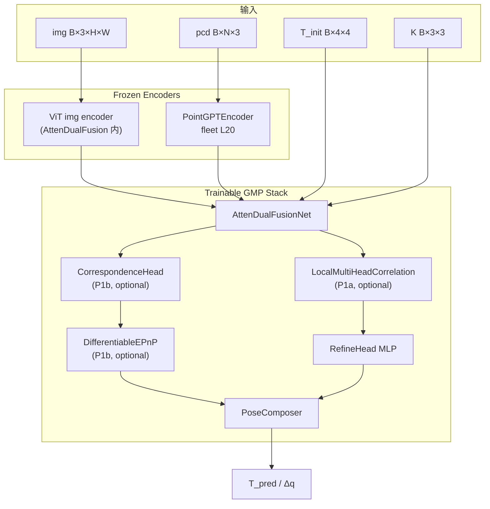

# V40 实验设计：GeoMatch-ProjCalib（GMP）

> 状态：设计草案 v0.5（2026-05-29，iterative_refine 默认 K=0）  
> 前置：`docs/V39_DESIGN.md`（HTCN 融合）、`docs/V37_GENERALIZATION_REPORT.md`（Jacobian vs MEDW 分裂）  
> 调研依据：开源 E2E LiDAR–Camera 标定综述 + [What Really Matters for Learning-based LiDAR-Camera Calibration](https://arxiv.org/html/2501.16969) (2025)  
> 推荐配置（待实现）：`configs/v40_gmp_p0.yaml` → `configs/v40_gmp_main.yaml`


## 0. 精简实验方案（推荐，省 GPU）

> 完整 P0–P3 ablation 矩阵见 §5。默认先跑 P0，通过后进 P1/P2。

| 步骤 | ID | 动作 | GPU 成本 | 前置 |
|------|-----|------|----------|------|
| 0 | B2 | v39 fast Exp1（外部对照，已在跑） | — | — |
| 0.5 | smoke | `v40_gmp_p0ab_smoke` 2ep | ~1h × 8卡 | 代码 + `_profile_modules` 修复 |
| 1 | P0-0' | GMP 基线：iter=0, geo=0（内部对照） | ~6.5h × 8卡 | smoke PASS |
| 2 | P0a / P0b | 单变量 ablation（geo / iter） | ~6.5h / ~12h | P0-0' 完成 |
| 3 | P0ab | iter1 + geo（交付候选） | ~12–15h × 8卡 | P0a/P0b 趋势 OK |
| 4 | P1b | MatchHead + DiffEPnP（优先） | ~16h × 8卡 | P0ab MEDW 趋势 OK |
| 5 | P1a | local correlation（可选） | ~16h × 8卡 | P1b 通过或并行 |
| 6 | P2 | P1c + DST/传感器配置模拟 | ~20h × 8卡 | P1c MEDW 趋势优于 V39 |
| 7 | P3 | 三阶段 progressive（10°→5°→3°） | 3× ~12h | P2 Gate PASS |

Gate（与 V39 保持一致，勿混用指标）：

```
smoke PASS（2ep，见 §6.3）：
  无 NaN / 无 crash；geo 项有有限值；Train Rot 从 ~4.5° 略降

训练内（val，复用 forward，趋势监控）：
  P0-0'→P0ab:  对照 P0-0'（同 backend/resolution），勿直接与 V39 B2 比 MEDW
  P0 PASS @ ep15:  MEDW(P0ab) <= MEDW(P0-0') + 0.05°  AND  无 NaN
                 Jacobian 仅监控（预期仍 WEAK，不设硬门槛）
  P1b PASS @ ep15: Jacobian(match_only) > 0.3  AND  match_valid_ratio > 0.4
  P1c PASS @ ep30: Jacobian(match_only) > 0.5  AND  MEDW 不劣于 P1b

训后（test_data_v2，正式交付，P3 链）：
  run_post_v39_medw.sh → MEDW < 0.413°   → 优于 v36
  run_post_v39_medw.sh → MEDW < 0.35°    → Gate PASS
  R/P/Y 分项 @ MEDW200 均 < 0.15°        → 可进 ±3° P3 冲 0.1°
  Jacobian > 0.85 @ ±10°                 → 仅 P3-A / P1c 交付项，非 P0
```

启动命令（P0 落地后）：

```bash
# V39 基线（对照，已在跑）
bash batch_train.sh configs/v39_fast.yaml

# V40 P0 smoke
bash batch_train.sh configs/v40_gmp_p0.yaml

# 训后 Gate
bash tools/run_post_v39_medw.sh \
  logs/all_training_data/model_small_10deg_v40_gmp_p0/all_training_data_scratch/checkpoint
```


## 1. 核心问题与 V40 目标

### 1.1 V39 暴露的分裂

| 能力 | v37 NativeCross | v39 proj_only (Exp1 观测) | 根因假设 |
|------|-----------------|---------------------------|----------|
| Jacobian ±10° | ✅ ~0.88 ADAPTIVE | ❌ WEAK (~-1.2 @ ep1) | 纯 MLP 回归头 → shortcut 复发 |
| MEDW200 | ❌ 0.46° | 趋势待观察 | 序列级稳定性不足 |
| HTCN gated fusion | Gate collapse | 已放弃主路径 | 不可解释 gate 坍缩 |

### 1.2 开源调研结论（2024–2026）

| 范式 | 代表 | 对 BEVCalib 的启示 |
|------|------|-------------------|
| 回归派 | RegNet, LCCNet, CalibFormer, CalibDepth | 论文指出即使 LCCNet cost volume 仍属 retrieval；仅借 correlation 特征，_pose 仍走匹配+几何_ |
| 一致性派 | CalibNet, RobustCalib | 训练期 appearance/depth consistency 强迫几何对齐 |
| 匹配派 | CFNet, DXQ-Net | 稀疏 2D–3D + 可微 EPnP → 论文推荐主路径；Jacobian 需 corr 监督，非自动满足 |
| 数据派 | DST-Calib, What Really Matters | 随机 T 扰动 ≠ 真实传感器配置变化；需双侧增强 + 传感器位姿模拟 |
| 工具派 | OpenCalib, MIAS-LCEC | 在线单帧工具，不能替代 fleet batch 训练 |

V40 设计原则：

1. 保留 V39 最强资产 — DINOv2 + PointGPT + AttenDualFusion + fleet L20 预训练  
2. 不复活 HTCN gated 主路径 — gate 仅作可选辅助，主路径必须几何可解释  
3. 双 KPI 同时优化 — MEDW（部署）+ Jacobian（shortcut guard），不再二选一  
4. 渐进落地 — P0 只改 loss/iter → P1 改 head → P2 改 data → P3 三阶段交付  
5. 指标分离 — 训练内 val-MEDW / Jacobian；训后 `test_data_v2` MEDW 为 Gate

### 1.3 V40 数值目标（按 Phase 分工，勿混用）

终局目标（P3 训后 `test_data_v2`）：

| 指标 | v36 基线 | v39 目标 | V40 终局 |
|------|----------|----------|--------------|
| 训后 MEDW200（±5°） | 0.413° | < 0.35° | < 0.30°（stretch 0.25°） |
| Jacobian ±10° | 0.29 | > 0.85 | > 0.85（与 v37 对齐） |
| 单帧 Rot（±5° val） | — | < 0.75° | < 0.60° |
| Roll @ MEDW200 | — | < 0.18° | < 0.12° |

分 Phase 交付 KPI（训练内 val）：

| Phase | 核心 KPI | Jacobian | 典型 wall-clock（8×L20, f500, 60ep） |
|-------|----------|----------|--------------------------------------|
| smoke | 无 NaN；geo 有值；Rot 略降 | 不评 | ~1h（2ep） |
| P0（P0-0'→P0ab） | MEDW200 趋势；PC_reproj↓ | 仅监控（预期 WEAK） | P0-0'/P0a ~6.5h；P0b/P0ab ~12–15h（iter1，~12s/step） |
| P1b | match_valid_ratio > 0.4 | > 0.3 @ ep15 | ~16h |
| P1c | MEDW 不劣 P1b | > 0.5 @ ep30 | ~16h |
| P2/P3 | 训后 MEDW Gate | P3-A 冲 0.85 | P2 ~20h；P3 链 3× ~12h |

> 注意：P0 不承担 Jacobian > 0.85。GMP 训练期 iter=0（单次 forward）；iter≥2 仅作可选 ablation。

### 1.4 `iterative_refine` 策略（v0.6 默认 K=0）

| K | 用途 | step 耗时（8×L20, GMP） | 说明 |
|---|------|-------------------------|------|
| 0 | V40 默认（所有主实验 / smoke / P1） | ~12s | 单次 AttenDualFusion + heads；GMP 下 K=0 与 K=1 等价 |
| 2+ | 可选 ablation | ~24s+ | 更新 T 后重跑 fusion；训练成本↑，MEDW 边际收益有限 |
| 3 | 已废弃 | ~34s | 不再用于主实验 |

决策依据（2026-05-29 更新）：

- GMP 实现中 `iter=0` 与 `iter=1` forward 路径相同（均 `n_iter=1`）；统一设 0 语义更清晰。
- iter=3 实测 ~34s/step，MEDW 仅 −0.04~0.08°，性价比差。
- 所有 V40 yaml 统一 `iterative_refine: 0`。

### 1.5 `differentiable_epnp=1` 稳定性（v0.6）

开启可微 EPnP 时的三层防护（2026-05-29 落地）：

1. MatchHead：`tanh` 限幅 Δuv（±32px）+ uv clamp + offset 零初始化
2. DiffEPnP：Gram-Schmidt 替代 PoseComposer 二次 SVD；`_StableProcrustesRotationFn` 清洗 SVD 反传 NaN
3. Warmup：`diff_epnp_warmup_epochs`（默认 5）前 detach pose→EPnP 梯度，MatchHead 先从 L_corr 收敛

验证：`python tools/smoke_test_diff_epnp_grad.py`（`differentiable_epnp=1` 无 NaN grad）


## 2. V40 统一架构：GeoMatch-ProjCalib（GMP）

在 V39 proj_only + AttenDualFusion 上演进，新增 显式 correlation、匹配头、几何一致性 loss，不替换 frozen encoder。

### 2.1 总体数据流

#### ASCII 总览

```
┌─────────────────────────────────────────────────────────────────────────────┐
│              GMP  (fusion_backend=geo_match_proj)                            │
├─────────────────────────────────────────────────────────────────────────────┤
│                                                                              │
│  img 640×360 ──► preprocess ──► img_vit 252×448 (+ K_vit 显式缩放)          │
│  pcd B×N×3   ──► PointGPT-L20 (frozen, 1× forward) ──► groups (B×G×D)      │
│                                                                              │
│  img_vit + groups + T_k + K ──► AttenDualFusion (trainable)                  │
│                                      │                                       │
│                                      ▼                                       │
│                         f_proj (B×D) + corr_tokens (B×G×D)                 │
│                                      │                                       │
│                    ┌─────────────────┴─────────────────┐                     │
│                    ▼                                   ▼                     │
│         LocalMultiHeadCorrelation (P1a, opt)  CorrespondenceHead (P1b, 主)   │
│                    │                                   │                     │
│                    └──────────────┬────────────────────┘                     │
│                                   ▼                                          │
│              ┌────────────────────────────────────────────┐                  │
│              │  HybridPoseHead (P0: MLP only → P1: dual)   │                  │
│              │    · RefineHead: Δq_reg  (MEDW 精度)        │                  │
│              │    · MatchHead:  corr → DiffEPnP → T_match  │                  │
│              │    · Compose: T_pred = T_match ⊕ ΔT_reg     │                  │
│              └────────────────────────────────────────────┘                  │
│                                                                              │
│  iterative_refine K=0: 单次 AttenDualFusion + heads（V40 默认）              │
│                                                                              │
│  Loss: L_pose + L_axis + L_PCreproj                                          │
│        + λ_app·L_proj_consist + λ_dep·L_proj_depth   [P0a 投影一致辅助]      │
│        + λ_corr·L_correspondence                       [P1b]                 │
│        + λ_seq·L_seq_consistency (MEDW surrogate)      [P2, opt]             │
└─────────────────────────────────────────────────────────────────────────────┘
```

#### Mermaid（实现级）



### 2.2 与 V39 模块对照

| V39 模块 | V40 处置 | 说明 |
|----------|----------|------|
| `HybridTripleCalib` BEV 支路 | 默认关闭 | `fusion_backend=geo_match_proj` 等价 proj_only |
| `ProjFusionBranch` | 保留 | 核心 fusion，接口不变 |
| `SingleBranchHead` | 升级为 `HybridPoseHead` | P0 可退化为 MLP |
| `GatedFusionHead` | 不用于 GMP 主路径 | 仅 ablation 对照 |
| `iterative_refine` | 默认 0 | GMP 单次 forward；iter≥2 仅 ablation |
| v32 `consistency_loss` | 扩展为 GeoConsistencyLoss | 当前为 pred 自一致；V40 加投影一致 |
| Jacobian eval | 保留 | val 复用 forward，零额外成本 |


## 3. 模块接口规范

> 新增文件均位于 `kitti-bev-calib/`。接口设计兼容现有 `HybridTripleCalib.from_args()` 工厂模式。

### 3.1 顶层模型：`GeoMatchProjCalib`

文件：`geo_match_proj_calib.py`

```python
class GeoMatchProjCalib(nn.Module):
    """V40 GMP: AttenDualFusion + optional GeoMatch heads."""

    FUSION_BACKENDS = ('geo_match_proj',)  # 注册到 bev_calib 工厂

    def init(
        self,
        img_shape=(640, 360),
        projfusion_image_hw=(252, 448),
        pointgpt_ckpt: str | None = None,
        pointgpt_config: str | None = None,
        pointgpt_max_depth: float = 60.0,
        # --- GMP modules (phase flags) ---
        use_local_correlation: bool = False,  # P1a
        use_match_head: bool = False,        # P1b（主路径）
        num_correspondences: int = 64,       # MatchHead 输出点数
        iterative_refine: int = 1,           # V40 default (was 3 in v0.4)
        # --- loss weights ---
        appearance_loss_weight: float = 0.0, # P0a
        depth_loss_weight: float = 0.0,      # P0a
        correspondence_loss_weight: float = 0.0,
        compose_mode: str = 'match_then_refine',  # | 'refine_only' | 'match_only'
        # --- inherited from V39 ---
        rotation_only: bool = True,
        enable_axis_loss: bool = True,
        weight_axis_rotation: float = 0.5,
        axis_weights=(1.0, 2.5, 1.0),
        use_balanced_axis_loss: bool = False,
        use_geodesic_loss: bool = False,
        head_dropout: float = 0.15,
        projfusion_margin: float = 2.0,
        kwargs,
    ): ...

    @classmethod
    def from_args(cls, args) -> 'GeoMatchProjCalib': ...

    def forward(
        self,
        img: torch.Tensor,              # B×3×H×W
        pc: torch.Tensor,               # B×N×3
        gt_T_to_camera: torch.Tensor,   # B×4×4
        init_T_to_camera: torch.Tensor, # B×4×4
        post_cam2ego_T: torch.Tensor,   # B×4×4 (unused if rotation_only)
        cam_intrinsic: torch.Tensor,    # B×3×3
        masks: torch.Tensor | None = None,
        out_init_loss: bool = False,
        domain_ids=None,
    ) -> tuple[dict, torch.Tensor]:
        """
        Returns:
            loss_dict: {'total_loss', 'rotation_loss', 'PC_reproj_loss',
                        'appearance_loss', 'depth_loss', 'correspondence_loss', ...}
            t_expected: B×4×4  # 与 V39 一致，供 Jacobian 收集
        """
```

工厂注册（`bev_calib.py` / `hybrid_triple_calib.py`）：

```python
# bev_calib.build_model(args)
if getattr(args, 'fusion_backend', '') == 'geo_match_proj':
    from geo_match_proj_calib import GeoMatchProjCalib
    return GeoMatchProjCalib.from_args(args)
```


### 3.2 `LocalMultiHeadCorrelation`（CalibFormer 式，非完整 CalibFormer）

文件：`gmp/local_correlation.py`  
借鉴：CalibFormer §III-C multi-head correlation + local window（以 T_init 投影位置为中心）

> 审计结论：CalibFormer 的 Swin Encoder + Transformer Pose Decoder 仍是回归派；What Really Matters 指出 LCCNet 式显式 matching 层也无法改变 retrieval 本质。  
> 因此 V40 只借 correlation 特征，不借 Transformer regression decoder 替换主路径。

```python
class LocalMultiHeadCorrelation(nn.Module):
    """
    在 AttenDualFusion 输出的 img/pc tokens 间做 local window multi-head correlation。
    窗口中心由 T_init 投影的 group 像素位置确定（CalibFormer window=d 思想）。
    输出 f_corr 供 MatchHead 或轻量 RefineHead，而非直接回归 6-DoF。
    """

    def init(
        self,
        token_dim: int = 384,
        num_heads: int = 4,
        window_radius: int = 4,    # CalibFormer window size d
        out_dim: int = 256,
    ): ...

    def forward(
        self,
        img_tokens: torch.Tensor,   # B×Hi×Wi×D  或 B×P×D（带 uv 索引）
        pc_tokens: torch.Tensor,    # B×G×D
        pc_uv_init: torch.Tensor,   # B×G×2  由 T_init+K 投影得到（必须显式 K）
        cam_info: dict,
    ) -> tuple[torch.Tensor, dict]:
        """
        Returns:
            f_corr: B×G×out_dim   每组点一条 correlation 特征（供 MatchHead）
            aux: {'corr_map': ..., 'valid_ratio': ...}  # TB / Jacobian 诊断
        """
```

Phase 开关：`use_local_correlation=0` 时 bypass（V39 行为不变）。

与旧版 CostVolumeCorrelation 的区别：旧设计用全局 depth bins，易落入论文批评的「depth distribution retrieval」；local window + T_init 锚定更接近真实 matching。


### 3.3 `CorrespondenceHead` + `DifferentiableEPnP`（DXQ-Net/CFNet 主路径）

文件：`gmp/match_head.py`, `gmp/diff_epnp.py`  
借鉴：CFNet calibration flow、DXQ-Net uncertainty-weighted PnP

> 审计结论：这是 What Really Matters 推荐的 matching-based + 几何求解 范式，应作为 P1 第一优先级，而非 CostVol 之后的补充。  
> Jacobian 仅在「匹配有监督 + valid_ratio 足够 + EPnP 稳定」时才会高，不能假设自然满足。

```python
class CorrespondenceHead(nn.Module):
    """从 fusion/correlation tokens 预测稀疏 2D–3D 对应 + 置信度。"""

    def init(
        self,
        token_dim: int = 384,
        num_points: int = 64,
        hidden: int = 256,
        use_gt_supervision: bool = True,  # 训练期用 T_gt 生成 pseudo uv 监督
    ): ...

    def forward(
        self,
        pc_groups_xyz: torch.Tensor,    # B×G×3  (LiDAR frame)
        fusion_tokens: torch.Tensor,    # B×G×D  或 f_corr
        cam_info: dict,
        T_init: torch.Tensor,
        T_gt: torch.Tensor | None = None,  # 训练期：生成 uv_gt 用于 L_corr
        K: torch.Tensor,
    ) -> dict:
        """
        Returns dict:
            uv: B×K×2          预测图像像素
            uv_gt: B×K×2       训练期 pseudo label（T_gt 投影，detach）
            xyz: B×K×3         对应 3D 点 (LiDAR frame)
            confidence: B×K
            validity: B×K      bool mask（低置信度过滤）
        """


class DifferentiableEPnP(nn.Module):
    """可微 EPnP / Kabsch 求解器（rotation_only 时仅 R）。"""

    def forward(
        self,
        xyz: torch.Tensor,          # B×K×3
        uv: torch.Tensor,           # B×K×2
        K: torch.Tensor,            # B×3×3
        weights: torch.Tensor,      # B×K
    ) -> torch.Tensor:
        """Returns R_match: B×3×3"""
```

Compose 策略（`gmp/pose_composer.py`）：

```python
class PoseComposer(nn.Module):
    compose_modes = ('refine_only', 'match_only', 'match_then_refine')

    def forward(
        self,
        R_match: torch.Tensor | None,   # B×3×3
        q_refine: torch.Tensor,           # B×4 quaternion delta
        T_init: torch.Tensor,
        mode: str = 'match_then_refine',
    ) -> tuple[torch.Tensor, dict]:
        """
        match_then_refine:
            R_pred = R_refine @ R_match @ R_init   (或 quat 复合)
        Returns:
            q_pred: B×4
            meta: {'R_match', 'q_refine', 'compose_mode'}
        """
```


### 3.4 `HybridPoseHead`

文件：`gmp/hybrid_pose_head.py`

```python
class HybridPoseHead(nn.Module):
    """统一封装 RefineHead + 可选 Match 路径。"""

    def init(
        self,
        proj_dim: int,
        hidden: int = 128,
        dropout: float = 0.15,
        use_match_head: bool = False,
        num_correspondences: int = 64,
        compose_mode: str = 'match_then_refine',
    ): ...

    def forward(
        self,
        f_proj: torch.Tensor,
        pc_groups_xyz: torch.Tensor,
        fusion_tokens: torch.Tensor,
        cam_info: dict,
        K: torch.Tensor,
        T_init: torch.Tensor,
    ) -> tuple[torch.Tensor, dict]:
        """Returns q_pred (B×4), meta (gate/corr stats)"""
```

P0 阶段：`use_match_head=False`，内部等价 `SingleBranchHead`。


### 3.5 损失函数：`GeoConsistencyLoss`（投影一致辅助 loss）

文件：`losses/geo_consistency_loss.py`  
命名说明：实现上 不是 RobustCalib 式 image warp 光度一致；而是比较  
`T_comp = inv(ΔT) @ T_init` 与 `T_gt` 在同一 640×360 图像上的 投影 uv/RGB/深度差。  
与 `rotation_loss` / `PC_reproj_loss` 部分冗余，P0 仅作 MEDW 辅助正则，不承诺消除 Jacobian shortcut。

```python
class GeoConsistencyLoss(nn.Module):
    """
    比较 T_comp 与 T_gt 将同一点云投影到主图 (640×360, K640) 的 RGB/深度差。
    T_comp 由 GeoMatchProjCalib 在外部计算：inv(ΔT_pred) @ T_init。
    仅在训练期启用；推理无额外分支。
    """

    def init(
        self,
        appearance_weight: float = 0.1,
        depth_weight: float = 0.05,
        max_points: int = 2048,
    ): ...

    def forward(
        self,
        img: torch.Tensor,           # B×3×H×W  @640×360
        pc: torch.Tensor,            # B×N×3
        T_pred: torch.Tensor,        # 传入 T_comp = inv(ΔT) @ T_init
        T_gt: torch.Tensor,            # B×4×4  ground truth
        K: torch.Tensor,               # K640
        mask: torch.Tensor | None = None,
    ) -> dict:
        """
        Returns:
            appearance_loss: 两路投影 uv 处 RGB 差的均值
            depth_loss: 两路投影相机系 z 的相对差 |z_comp - z_gt| / z_gt
            geo_valid_ratio: 有效投影点比例（TB 监控）
        """
```

与现有 v32 consistency 的关系：

| 损失 | 现有 v32 | V40 GeoConsistency（实现） |
|------|----------|---------------------------|
| 约束对象 | pred(T_init) vs pred(T_init+noise) 自一致 | T_comp vs T_gt 的投影一致 |
| 作用 | 防 T_init 泄漏 | 辅助 pose 几何；shortcut 靠 P1b |
| 权重 CLI | `--consistency_loss_weight` | `--appearance_loss_weight` / `--depth_loss_weight` |
| warmup | — | `geo_loss_start_epoch=5`（main）；smoke 可设 0 |

两者可并存；P0a 建议先只开 GeoConsistency，避免 loss 过多。`geo_loss_start_epoch` 前 5ep 仅 L_pose，缓解与 PC_reproj 的梯度冲突（§8）。


### 3.6 数据增强：`DSTDoubleSidedAug`

文件：`datasets/dst_augment.py`（P2）  
借鉴：DST-Calib double-sided augmentation

```python
class DSTDoubleSidedAug:
    """
    在 mount jitter 基础上，用估计/稀疏深度合成第二视角相机参数，
    使 FOV 重叠区与点云密度变化更接近真实传感器迁移。
    """

    def init(
        self,
        prob: float = 0.5,
        virtual_pitch_range_deg: float = 3.0,
        virtual_height_range_m: float = 0.15,
        resample_overlap: bool = True,
    ): ...

    def call(self, sample: dict) -> dict:
        """
        Input sample: img, pc, K, T_gt, T_init, ...
        May output augmented view as second sample in batch OR in-place warp.
        """
```

CLI：`--dst_double_sided 1`, `--dst_prob 0.5`


### 3.7 CLI / YAML 新增参数

| 参数 | 类型 | 默认 | Phase | 说明 |
|------|------|------|-------|------|
| `fusion_backend` | str | `proj_only` | — | V40 设为 `geo_match_proj`；V39 保持 `proj_only` 不变 |
| `pose_head_type` | str | `mlp` | — | `mlp` \| `hybrid_match` \| `hybrid_match_corr` |
| `use_local_correlation` | int | 0 | P1a | CalibFormer 式 local correlation |
| `use_match_head` | int | 0 | P1b | Correspondence + EPnP |
| `correspondence_supervision` | int | 1 | P1b | 用 T_gt 投影生成 uv 伪标签 |
| `match_valid_ratio_min` | float | 0.3 | P1b | valid_ratio 低于此值 fallback refine_only |
| `num_correspondences` | int | 64 | P1b | 匹配点数 K |
| `compose_mode` | str | `match_then_refine` | P1b | Pose 复合方式 |
| `appearance_loss_weight` | float | 0.0 | P0a | RobustCalib 光度一致 |
| `depth_loss_weight` | float | 0.0 | P0a | RobustCalib 深度一致 |
| `correspondence_loss_weight` | float | 0.0 | P1b | 匹配监督（若有 pseudo corr） |
| `iterative_refine` | int | 0→1 | P0b | 迭代步数 K（禁止默认 3） |
| `dst_double_sided` | int | 0 | P2 | 双侧增强 |
| `dst_prob` | float | 0.5 | P2 | 增强概率 |

透传链：`batch_train.sh` OPTIM_PARAMS → `start_training.sh` → `train_universal.sh` → `train_kitti.py`（与 V39 gate_entropy 修复同一模式）。


## 4. 训练 Recipe（默认）

基于 `v39_fast.yaml`，V40 P0 改动最小集。所有 P0 实验统一 `fusion_backend=geo_match_proj` + `projfusion_image_hw=[252,448]`（M-1），与 V39 B2 的差异（224×448、`proj_only`）作为 外部参考，不作为 P0 内部 ablation 对照。

### 4.1 Pretrain 策略（必读）

| 优先级 | checkpoint | 适用 | 说明 |
|--------|------------|------|------|
| 推荐 | V39 Exp1 `proj_only` `ckpt_best_medw.pth` | P0 / P1 / P3-B/C | `fusion_head` 384 维与 GMP 一致；`proj_branch` 可加载（224→252 可能 skip 少量 shape） |
| 备选 | HTCN `ckpt_best_medw.pth` | V39 Exp1 未完成时 | `fusion_head` 128 维 gated → 冷启动；仅 `proj_branch`/encoder 部分加载 |
| 禁止 | 无 pretrain 直接 60ep | — | head 冷启动 + iter 收敛慢 |
| 禁止 | 主实验 `iterative_refine=0` | — | wall-clock 3×，MEDW 边际收益不足（§1.4） |

路径示例（随 V39 Exp1 更新）：

```yaml
pretrain_ckpt: logs/all_training_data/model_small_10deg_v39_fast_exp1_wide_10deg/all_training_data_scratch/checkpoint/ckpt_best_medw.pth
```

P3 链 pretrain：P3-A ← V39 Exp1 或 P0ab best；P3-B ← P3-A best MEDW；P3-C ← P3-B best MEDW。

### 4.2 默认 yaml 片段

```yaml
# configs/v40_gmp_p0.yaml
defaults:
  params:
    fusion_backend: geo_match_proj   # 所有 P0 实验固定
    pc_encoder_mode: pointgpt2bev
    batch_size: 32
    learning_rate: 4.6e-4
    max_frames_per_seq: 500
    num_epochs: 60
    eval_epoches: 15
    rotation_only: true
    iterative_refine: 0              # P0b/P0ab/P1/full 默认；P0-0'/P0a 覆盖为 0
    projfusion_image_hw: [252, 448]  # M-1: 保持 640:360 宽高比
    appearance_loss_weight: 0.1      # P0a/P0ab；P0-0'/P0b 覆盖为 0
    depth_loss_weight: 0.05
    geo_loss_start_epoch: 5          # main：ep0-4 仅 L_pose；smoke 覆盖为 0
    enable_jacobian_eval: 1
    enable_medw_eval: 1
    use_local_correlation: 0
    use_match_head: 0
    pretrain_ckpt: logs/.../v39_fast_exp1_wide_10deg/.../ckpt_best_medw.pth
```

三阶段 progressive（P3）复用 `v39_fast.yaml` Exp1/2/3 结构，仅替换 `fusion_backend` 与 V40 loss 权重。


## 5. Ablation 实验矩阵

### 5.1 分组逻辑

```
Phase-0  Baseline 锚定     →  V39 fast Exp1 / v36 / v37 numbers
Phase-P0 训练约束 ablation  →  不改 head，验证 consistency + iter
Phase-P1 结构 ablation      →  CostVol / MatchHead 正交叠加
Phase-P2 数据 ablation      →  DST 双侧增强
Phase-P3 交付链             →  10°→5°→3° progressive
```

### 5.2 Phase-0：Baseline 锚定（eval + 对照训练）

| ID | 名称 | 架构 | 用途 |
|----|------|------|------|
| B0 | v36 Ep191 | Query + Spconv | MEDW 历史最佳 0.413° |
| B1 | v37 Ep241 NativeCross | NC + fleet PGPT | Jacobian 最佳 ~0.88 |
| B2 | v39 fast Exp1 | proj_only + MLP | V40 直接对照（进行中） |
| B3 | ProjFusion standalone | AttenDualFusion eval | Proj 支路上限 |

### 5.3 Phase-P0：训练约束 ablation（固定 GMP backend + MLP head）

固定不变（所有 P0 行）：±10°, 60ep, f500, bs32, 8×DDP, `geo_match_proj`, `[252,448]`, `explicit_k_vit`, V39 Exp1 pretrain。  
仅变：`iterative_refine` / geo loss 权重。

| ID | iterative_refine | appearance_w | depth_w | 验证假设 | wall-clock |
|----|------------------|--------------|---------|----------|------------|
| P0-0' | 0 | 0 | 0 | GMP 内部基线（非 V39 B2） | ~6.5h |
| P0a | 0 | 0.1 | 0.05 | geo 辅助 loss 对 MEDW 的影响 | ~6.5h |
| P0b | 1 | 0 | 0 | iter refine 对 MEDW 的影响（vs P0-0'） | ~12h |
| P0ab | 1 | 0.1 | 0.05 | 组合最优（P0 交付候选） | ~12–15h |
| P0c | 1 | 0.1 | 0.05 | + 传感器配置模拟（见 §11.4） | ~12–15h |

外部参考（不参与 P0 Gate 公式）：

| ID | 说明 |
|----|------|
| B2 | v39 `proj_only` 224×448 iter=0 — 已在跑，MEDW/Jacobian 趋势仅作参考 |
| B0 | v36 Ep191 训后 MEDW 0.413° |

P0 判定（Epoch 15，对照 P0-0'，不对照 B2）：

```
PASS if:  MEDW(P0ab) <= MEDW(P0-0') + 0.05°
       AND train/val 无 NaN
       AND PC_reproj 趋势下降
MONITOR: Jacobian(P0ab) — 预期仍 WEAK（~ -1.x），不设硬门槛
MONITOR vs B2: MEDW 差距 > 0.1° 时检查 pretrain/resolution，不作为 FAIL
FAIL → 调 λ_app/λ_dep / geo_loss_start_epoch，或直接进 P1b
```

smoke 判定（2ep，见 §6.3）：与 P0 Gate 独立，通过后启用 `v40_gmp_p0ab_main`。

### 5.4 Phase-P1：结构 ablation（固定 P0ab recipe）

| ID | use_local_correlation | use_match_head | compose_mode | 验证假设 |
|----|-----------------|----------------|--------------|----------|
| P1-0 | 0 | 0 | refine_only | = P0ab |
| P1b | 0 | 1 | match_only | DXQ/CFNet 主路径；Jacobian 核心验证 |
| P1a | 1 | 0 | refine_only | local correlation 特征质量（不含 MatchHead） |
| P1c | 1 | 1 | match_then_refine | GMP 完整结构（match 主 + corr 辅 + MLP 残差） |

P1 判定（Epoch 30）：

```
P1b PASS:  Jacobian(match_only) > 0.3 @ ep15  AND  match_valid_ratio > 0.4
P1c PASS:  Jacobian(match_only) > 0.5 @ ep30  AND  MEDW(P1c) < MEDW(P1b)
对照:     P1b vs B1(NativeCross) Jacobian 上界
```

### 5.5 Phase-P2：数据 ablation（固定 P1c 结构）

| ID | max_frames | dst_double_sided | 其他增强 | 验证假设 |
|----|------------|------------------|----------|----------|
| P2-0 | 500 | 0 | v39 默认 | P1c 基线 |
| P2a | 1000 | 0 | — | 数据量 vs f500 shortcut |
| P2b | 500 | 1 | dst_prob=0.5 | 双侧增强泛化 |
| P2c | 1000 | 1 | + intrinsic jitter 0.02 | P2 交付候选 |

P2 判定：训后 `run_post_v39_medw.sh` MEDW200 < 0.35°。

### 5.6 Phase-P3：三阶段交付链

| ID | angle | epochs | pretrain | 目标 |
|----|-------|--------|----------|------|
| P3-A | ±10° | 60 | HTCN/v39 ckpt | Jacobian > 0.85 |
| P3-B | ±5° | 50 | P3-A best MEDW | MEDW < 0.30° |
| P3-C | ±3° | 40 | P3-B best MEDW | R/P/Y < 0.12° @ MEDW |

### 5.7 正交维度汇总表

| 维度 | Levels | 对应实验 ID |
|------|--------|-------------|
| Fusion backend | `geo_match_proj`（P0 全固定）/ B2=`proj_only`（外部） | P0-0' vs B2 |
| Loss | none / geo / +corr | P0-0' → P0a → P0ab → P1c |
| Head | MLP / +CostVol / +Match | P1-0 → P1a → P1b → P1c |
| Iteration | K=0 / K=0 | P0-0' vs P0b |
| Data | f500 / f1000 / +DST | P2-0 → P2a → P2b → P2c |
| Progressive | 单阶段 / 三阶段 | P1c vs P3-A/B/C |


## 6. 实现规划

### 6.1 新增文件

```
kitti-bev-calib/
  camera_geometry.py            # M-1: scale_intrinsics + project
  geo_match_proj_calib.py       # GMP 主模型 (M0+M1 已实现)
  gmp/
    init.py
    local_correlation.py        # P1a CalibFormer 式
    match_head.py               # P1b
    diff_epnp.py                # P1b
    pose_composer.py            # P1b
    hybrid_pose_head.py         # 统一 head
  losses/
    geo_consistency_loss.py     # P0a
  datasets/
    dst_augment.py              # P2
configs/
  v40_gmp_p0.yaml               # P0ab
  v40_gmp_p1.yaml               # P1 matrix
  v40_gmp_p2.yaml               # P2 matrix
  v40_gmp_progressive.yaml      # P3 chain
docs/
  V40_DESIGN.md                 # 本文档
```

### 6.2 修改文件

| 文件 | 改动 |
|------|------|
| `hybrid_triple_calib.py` | `build_calib_model` 路由 `geo_match_proj` |
| `projfusion_branch.py` | M-1: `explicit_k_vit_scale` + `preprocess_image_and_intrinsics` |
| `train_kitti.py` | V40 argparse；`set_training_epoch`；geo loss 日志 |
| `batch_train.sh` | OPTIM_PARAMS 新增 V40 键 |
| `start_training.sh` / `train_universal.sh` | 参数透传 |
| `hybrid_triple_calib.py` proj_only | 无改动（V39 隔离） |

### 6.3 实现里程碑

| 里程碑 | 内容 | 验收 |
|--------|------|------|
| M-1 | `camera_geometry.py` + ProjFusion `explicit_k_vit_scale` | `tests/test_camera_geometry.py` PASS；uv 误差 < 0.5px |
| M0 | `GeoMatchProjCalib` 包装 + CLI + `v40_gmp_p0.yaml` | smoke forward 无 NaN；不要求与旧 V39 数值一致 |
| M1 | GeoConsistencyLoss + iterative_refine=1 | smoke 2ep 无 NaN（§6.3） |
| M2 | LocalMultiHeadCorrelation | P1a smoke |
| M3 | MatchHead + DiffEPnP + Composer | P1b smoke, Jacobian 可算 |
| M4 | DST augment + yaml 全套 | P2 可 batch_train |
| M5 | progressive yaml + 文档 Gate 脚本 | 与 v39_fast 同 UX |

### 6.3.1 Smoke Gate（`v40_gmp_p0ab_smoke`，2ep）

与 P0 @ ep15 Gate 独立；通过后手动启用 `v40_gmp_p0ab_main`（或按需跑 P0-0'/P0a/P0b）。

```
smoke PASS if:
  · 无 crash / NaN / AttributeError
  · step 日志出现 geo[app=..., dep=...]（geo_loss_start_epoch=0）
  · Ep1 val：MEDW200 有限值（不劣于 ~0.55° 即可）
  · Train Rot：ep1 ~4–5° → ep2 略降或持平
smoke FAIL → 修代码/配置，勿开 60ep main
```

### 6.4 闲置 8 卡并行建议

| 机器 | 实验 | 目的 | 预估时间 |
|------|------|------|----------|
| 主机器 | v39 fast Exp1（已在跑） | 外部对照 B2 | ~6.5h/60ep |
| 另一台 8 卡 | smoke → P0-0' → P0a/P0b → P0ab | P0 ablation 链 | smoke ~1h；P0ab ~12–15h |
| 同机 | 禁止与 V39 抢 8 卡 | NCCL/GPU 冲突 | — |


## 7. 监控与诊断

### 7.1 TensorBoard 新增标量

| 标量 | 含义 | 异常 |
|------|------|------|
| `Epoch/train/appearance_loss` | 光度一致 | 长期 > 0.5 不下降 → λ 过大 |
| `Epoch/train/depth_loss` | 深度一致 | NaN → 投影 mask 为空 |
| `Epoch/train/correspondence_loss` | 匹配损失 | P1b+ 才有 |
| `Epoch/train/match_valid_ratio` | 有效匹配点比例 | < 0.3 → EPnP 不稳定 |
| `Epoch/val/jacobian_overall` | Shortcut guard | < 0 @ ep15 → 停训诊断 |
| `Epoch/val/medw200` | 部署趋势 | 上升 → 过拟合 / perturb 过大 |

### 7.2 失败诊断树

```
Jacobian WEAK @ ep15
├─ P0ab 仍 WEAK → 开 P1b (MatchHead)
├─ P1c 仍 WEAK → 检查 corr 可视化；回退 v37 NativeCross 作 upper bound
└─ P1c ADAPTIVE 但 MEDW 差 → 进 P2 DST / f1000

MEDW 训后 > 0.35°
├─ 单帧 Rot 已 < 0.6° → 序列一致性不足 → 加 seq loss / progressive P3
├─ Pitch @ MEDW 偏高 → axis_weights 提 Pitch；augment_pitch 加强
└─ seq00 Roll 偏高 → pose_aware + Roll oversample
```


## 8. 风险与不做清单

| 风险 | 缓解 |
|------|------|
| GeoConsistency 与 PC_reproj 梯度冲突 | `geo_loss_start_epoch=5` warmup；P0 不指望降 shortcut |
| DiffEPnP 数值不稳定 | confidence 阈值 + fallback refine_only |
| iter=3 wall-clock 过高 | v0.5 起默认 iter=0（§1.4）；P0-0'/P0a 仍用 iter=0 控时；iter=3 仅作可选 ablation |
| Pretrain 用 HTCN 导致 head 冷启动 | 默认 V39 Exp1 proj_only ckpt（§4.1） |
| P0ab 与 B2 混比导致误判 | Gate 只对照 P0-0'（§5.3） |
| 参数透传遗漏 | 每个新 CLI 同时改 batch/start/universal 三层 |
| P2 全量 f1000 超时 | P2c 才开 f1000；P0/P1 保持 f500 |

明确不做：

- 不整体迁移 LCCNet/RegNet 代码（encoder 降级）
- 不将 HTCN gated fusion 作为 V40 主路径
- 不用 OpenCalib/SAM 替代 fleet 训练 pipeline
- 不将训练内 MEDW 与 v36 test_data_v2 直接对比


## 9. 参考文献与开源索引

| 类别 | 工作 | 链接 | V40 借鉴点 |
|------|------|------|-----------|
| 综述 | What Really Matters (2025) | [arxiv:2501.16969](https://arxiv.org/html/2501.16969) | 主审计依据；matching+几何约束 |
| Local Corr | CalibFormer | [arxiv:2311.15241](https://arxiv.org/html/2311.15241) | 只借 multi-head local correlation，不借 Transformer 回归头 |
| Cost Volume | LCCNet | [github.com/sicong-li/LCCNet](https://github.com/sicong-li/LCCNet) | 论文认为仍属 retrieval；V40 不单独依赖 |
| Consistency | RobustCalib | [arxiv:2312.01085](https://arxiv.org/html/2312.01085v1) | appearance/depth loss |
| 迭代 | CalibDepth | ICRA'23 | iterative refine |
| 数据 | DST-Calib | [arxiv:2601.01188](https://arxiv.org/html/2601.01188v1) | double-sided aug |
| 匹配 | CFNet / DXQ-Net | 论文 | EPnP + correspondence |
| 工具 | OpenCalib | [SensorsCalibration](https://github.com/PJLab-ADG/SensorsCalibration) | 训后单帧验证参考 |


## 10. V39 / V40 共存开关策略

结论：可以。 通过 `fusion_backend` + 独立 pose/loss 开关，V39 训练路径与 V40 开发完全隔离，默认全关 = 现有 V39 行为。

### 10.1 隔离原则

| 原则 | 做法 |
|------|------|
| 不改 V39 forward | `fusion_backend=proj_only` 仍走 `HybridTripleCalib`，不 import GMP 模块 |
| V40 独立文件 | `geo_match_proj_calib.py` + `gmp/*`，仅在 `fusion_backend=geo_match_proj` 时加载 |
| 默认关闭 | 所有 V40 CLI 默认 0 / `mlp`，yaml 未写则与 V39 一致 |
| 独立 log_suffix | `v40_gmp_*` vs `v39_fast_*`，避免 checkpoint 互相 skip |
| 不在 V39 分支改 recipe | `v39_fast.yaml` 不修改；V40 用 `v40_gmp_*.yaml` |

### 10.2 工厂路由（`build_calib_model`）

```python
def build_calib_model(args, ...):
    backend = getattr(args, 'fusion_backend', 'bev') or 'bev'
    if backend == 'geo_match_proj':
        from geo_match_proj_calib import GeoMatchProjCalib
        return GeoMatchProjCalib.from_args(args).to(device)
    if backend in HybridTripleCalib.FUSION_BACKENDS:
        return HybridTripleCalib(...).to(device)   # V39 不变
    return BEVCalib(...).to(device)
```

### 10.3 开关矩阵

| 开关 | V39 典型值 | V40 P0 | V40 P1c | 说明 |
|------|-----------|--------|---------|------|
| `fusion_backend` | `proj_only` | `geo_match_proj` | `geo_match_proj` | 主隔离键 |
| `pose_head_type` | （隐式 mlp） | `mlp` | `hybrid_match_corr` | 不改 backend 也可预留 |
| `use_match_head` | 0 | 0 | 1 | Match+EPnP |
| `use_local_correlation` | 0 | 0 | 1 | CalibFormer correlation |
| `appearance_loss_weight` | 0 | 0.1 | 0.1 | GeoConsistency |
| `iterative_refine` | 0 | 1 | 1 | V40 默认 K=0（v0.5） |
| `dst_double_sided` | 0 | 0 | 1 | P2 数据增强 |

### 10.4 实施注意

1. 禁止在 `hybrid_triple_calib.py` 的 `proj_only` 分支内嵌 V40 逻辑——避免影响正在跑的 Exp1。  
2. V40 smoke test 用 `--log_suffix v40_gmp_smoke`，与 `v39_fast_exp1` 目录分离。  
3. 若需同机并行：必须使用另一台闲置 8 卡机器跑 V40；禁止与 V39 同机抢 GPU（§6.4）。  
4. 合并到 main 前：CI 增加 `fusion_backend=proj_only` 回归测试，断言 loss 曲线与 V39 baseline 一致。


## 11. 论文审计与方案修正（What Really Matters + CalibFormer + DXQ-Net）

> 参考：Huang et al., What Really Matters for Learning-based LiDAR-Camera Calibration, 2025  
> 本地 PDF：`/home/ludahai/Downloads/papers/calib_based_transformer/What Really Matters...pdf`

### 11.1 论文核心结论 ↔ V40 原方案差距

| 论文结论 | 原 V40 方案 | 修正 |
|----------|-------------|----------|
| 回归网络学的是 depth map 空间分布 → T 的检索，非跨模态匹配 | P1a CostVolume + MLP RefineHead 仍属回归 | Match+EPnP 升为主路径；correlation 只作 MatchHead 输入 |
| LCCNet 式 cost volume 也不能改变 retrieval 本质 | P1a 优先于 P1b | P1b 优先；P1a 降为可选增强 |
| 随机 T 扰动 ≠ 传感器安装变化（FOV 重叠、点云密度变） | DST 放在 P2 | 新增 P0c 传感器配置模拟，与 P0ab 同期验证 |
| 内参必须在 resize/crop 后显式缩放 | 文档未强调 | AttenDualFusion 已传 K；禁止无 K 更新的 random crop |
| 点云 densify/downsample 影响回归 clue | 仅有 augment_pc_dropout | P0c 增加 FOV 裁剪点云 + beam dropout |
| 出路：matching-based + 显式几何约束 | 方向正确 | 加强 L_corr（uv 伪标签） + 已有 PC_reproj |

### 11.2 CalibFormer 正确借法（勿整包替换 MLP）

| CalibFormer 组件 | 是否借 | V40 用法 |
|------------------|--------|----------|
| Multi-head local correlation | ✅ | → `LocalMultiHeadCorrelation` → MatchHead 输入 |
| Swin Encoder + Transformer Decoder → 回归 t,q | ❌ | 仍是回归派；最多作 Δq 残差（`pose_head_type=hybrid_match_corr` 且权重小） |
| Camera-guided pose query | ⚠️ | 可选初始化 MatchHead query；不能替代 EPnP |
| Point cloud distance loss L_p | ✅ | 已有 `PC_reproj_loss`，保持并监控 |
| T_hat = T_pred⁻¹ @ T_init | ✅ | 与 BEVCalib `realworld_loss` 复合约定一致，实现时 double-check |

### 11.3 DXQ-Net / CFNet 正确借法

| 要点 | V40 实现 |
|------|----------|
| Correspondence + EPnP | `CorrespondenceHead` + `DifferentiableEPnP` |
| 不确定性加权 | `confidence` 传入 EPnP weights |
| 训练监督 | 必须加 `L_corr = \|uv_pred - uv_gt\|`（T_gt 投影伪标签） |
| rotation_only | EPnP 只求 R；MLP RefineHead 只输出 Δq 残差 |
| Jacobian | 训练内继续 val 复用 forward 监控；EPnP valid_ratio < 0.3 时 fallback MLP |
| 「自然满足」 | 删除此假设——无 corr 监督时 Match 分支仍可能 shortcut |

### 11.4 P0c：传感器配置模拟（论文 III-C 直接回应）

在现有 `augment_mount_jitter` 之上增加（不改 V39 默认）：

```yaml
# v40 专用
sensor_config_aug:
  fov_crop_prob: 0.3          # 模拟安装高度变化 → 重叠区缩小
  fov_crop_ratio: 0.85        # 保留中心 85% 点云
  beam_dropout_prob: 0.2      # 模拟线数/密度变化（论文 Tab III）
  beam_dropout_ratio: 0.1     # 随机丢 10% 点
  intrinsic_jitter: 0.02        # fx/fy/cx/cy 小幅扰动（配合 K 传入网络）
```

禁止：对 LiDAR depth map 做 random crop 而不更新 K（论文 Tab II 已证明损害泛化）。

### 11.5 修订后的 P1 判定

```
P1b PASS:  Jacobian(P1b) > 0.3 @ ep15  AND  match_valid_ratio > 0.4
P1c PASS:  Jacobian(P1c) > 0.5 @ ep30  AND  MEDW 不劣于 P1-0
P1a 可选:  P1c vs P1b 的 Jacobian 增量 < 0.1 → 可省略 local correlation
```


## 12. 变更记录

| 日期 | 版本 | 说明 |
|------|------|------|
| 2026-05-28 | v0.1 | 初稿：GMP 架构、模块接口、P0–P3 ablation 矩阵 |
| 2026-05-28 | v0.2 | What Really Matters 审计：P1b 优先、CalibFormer 只借 correlation、DXQ corr 监督、P0c 传感器模拟、V39/V40 开关策略 |
| 2026-05-29 | v0.5 | iterative_refine 默认 K=0（原 K=3 废弃于主实验）；§1.4 策略；wall-clock 修订为 ~12–15h |
| 2026-05-28 | v0.4 | P0 ablation 改为 P0-0' 内部对照；§1.3 Phase KPI；GeoConsistency 名实一致；pretrain/wall-clock/smoke gate |
| 2026-05-28 | v0.3 | M-1 K_vit（252×448）；修订 P0/P1 Gate；M0+M1 代码：`geo_match_proj_calib.py`、`geo_consistency_loss.py`、`v40_gmp_p0.yaml` |


## 13. M-1：K_vit 与坐标系规范（实现必读）

### 13.1 问题

主 pipeline 图像 640×360 的 K 在 `crop_and_resize` 中已正确缩放；Proj 支路原先非等比 resize 到 224×448 且未显式更新 K，存在论文 III-C 同类 inductive bias 风险。

### 13.2 修复（已实现）

| 组件 | cam_space | 分辨率 | K |
|------|-----------|--------|---|
| 主 loss / GeoConsistency | `main` | 640×360 | K640 |
| AttenDualFusion | `vit` | 252×448 | K_vit = scale(K640) |

- `camera_geometry.scale_intrinsics_for_resize()`
- `ProjFusionBranch(explicit_k_vit_scale=True)` — 仅 GMP；V39 默认 `False`
- 单测：`kitti-bev-calib/tests/test_camera_geometry.py`

### 13.3 P1 模块坐标约定

- GeoConsistency：`(img@640, K640)`
- MatchHead / LocalCorr：`(img_vit, K_vit)`；uv 必须标注 cam_space
- intrinsic_jitter：先 K640，再 scale → K_vit

### 13.4 审计要点

| 要点 | 处置 |
|------|------|
| T_init 条件 fusion | P1b Match 需 T_indep 特征（M3） |
| P0 不保证 Jacobian | P0 Gate 只看 MEDW |
| match_then_refine | P1b 用 `match_only` |
| rotation_only | 部署约束，保持 |
| EPnP 退化 | M3：spread 采样 + fallback 分统计 |

---

## 14. 后续：V41 严格同分布 Gate（2026-05-29）

V40 P0–P1 阶段训练内 Gate 对 Jacobian **仅监控**；V40 实测出现 **MEDW 与 Jacobian 脱钩**（val MEDW ~0.17° 但 Pitch J≈0，bag Recover 11–13%）。

**V41 将同分布 val dual gate 定为必过红线**，不再接受「MEDW 趋势 OK 即可交付」：

| 条件 | 阈值 |
|------|------|
| MEDW200 | `max(R,P,Y) < 0.10°` |
| Jacobian @ ±3° | overall + R/P/Y 均 `> 0.85` |

三组 ablation（A: geo+V32+jacloss → B: +match → C: +diff_epnp）、验收解读、失败排查与启动命令见 **`docs/V41_DESIGN.md`**。
