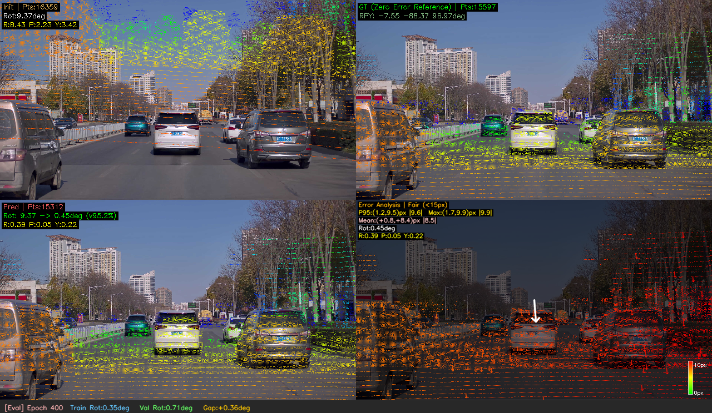

# BEVCalib 可视化参数说明文档

本文档详细说明 BEVCalib 训练、验证、评估阶段生成的 **2×2 投影可视化面板** 中所有文本标注的含义，以及如何利用这些信息评估模型训练性能和泛化能力。

---

## 1. 面板整体布局

每张可视化图由 **2×2 网格** + **底部信息栏** 组成：

```
┌─────────────────┬──────────────────────┐
│   Init (初始值)  │ GT (零误差参考)       │
├─────────────────┼──────────────────────┤
│   Pred (预测值)  │ Error Analysis (误差)│
├─────────────────┴──────────────────────┤
│ [Phase] Epoch X | Train ... | Val ...  │
└────────────────────────────────────────┘
```

- **Init 面板** (左上): 使用初始外参（含扰动）投影的点云
- **GT 面板** (右上): 使用真值外参投影的点云（零误差参考）
- **Pred 面板** (左下): 使用模型预测外参投影的点云
- **Error Analysis 面板** (右下): 位移热力图 + 误差统计
- **底部信息栏**: 训练/验证/评估阶段标识和 epoch 级别的 Train vs Val 性能对比

---

## 2. Init 面板 (左上角)



### 文本说明

| 文本 | 含义 | 示例 |
|------|------|------|
| `Init \| Pts:17219` | "Init"表示使用初始外参投影；Pts=投影到图像内的有效点数 | 17219个点在图像范围内 |
| `Rot:6.93deg` | 初始外参与GT之间的旋转总误差（轴角度量） | 初始扰动引入了6.93°旋转偏差 |
| `R:5.32 P:3.68 Y:2.50` | Roll/Pitch/Yaw 三个轴的旋转误差分量（度） | Roll偏5.32°, Pitch偏3.68°, Yaw偏2.50° |
| `Trans:0.208m` *(仅非rotation_only模式)* | 初始外参与GT之间的平移总误差（米） | 初始扰动引入0.208m平移偏差 |
| `Fwd:0.100 Lat:0.080 Ht:0.120m` *(仅非rotation_only模式)* | 前向/横向/高度三个方向的平移误差分量 | 前向偏0.100m等 |

**解读**: Init 面板展示模型的输入条件——即初始外参的质量。扰动越大，Init 面板中点云与图像语义对象的错位越明显。这是模型需要纠正的起始误差。

---

## 3. GT 面板 (右上角)

### 文本说明

| 文本 | 含义 | 示例 |
|------|------|------|
| `GT (Zero Error Reference) \| Pts:15491` | "GT"表示使用真值外参投影；括号内表示这是零误差参考基准 | 零误差时有15491个点投影到图像内 |
| `RPY: -7.55 -68.37 96.97deg` | GT外参旋转矩阵对应的 Roll/Pitch/Yaw 绝对欧拉角（参考信息） | 传感器安装姿态的绝对角度 |
| `XYZ: 0.050 -0.300 0.550m` *(仅非rotation_only模式)* | GT外参的平移向量（相机在LiDAR坐标系中的位置） | 传感器安装位置的绝对坐标 |

**解读**: GT 面板是"完美对齐"的参考基准。点云应该精确叠加在图像中对应的语义对象上（如车辆轮廓、路面标线、建筑物边缘）。模型的目标就是让 Pred 面板尽可能接近 GT 面板的效果。

> RPY 和 XYZ 以暗绿色显示，表示它们是参考信息，不需要重点关注。

---

## 4. Pred 面板 (左下角)

### 文本说明

| 文本 | 含义 | 示例 |
|------|------|------|
| `Pred \| Pts:15565` | "Pred"表示使用模型预测的外参投影 | 预测外参下有15565个点投影到图像内 |
| `Rot: 6.93 -> 0.40deg (v94.3%)` | **改进指标**: 初始旋转误差 → 预测旋转误差（降低百分比） | 初始6.93°→预测0.40°，降低94.3% |
| `R:0.10 P:0.16 Y:0.35` | Roll/Pitch/Yaw 三个轴的预测旋转误差分量（度） | Yaw误差0.35°最大 |
| `Trans: 0.208 -> 0.004m (v98.2%)` *(仅非rotation_only模式)* | **改进指标**: 初始平移误差 → 预测平移误差（降低百分比） | 平移误差从0.208m降到0.004m |
| `Fwd:0.002 Lat:0.001 Ht:0.003m` *(仅非rotation_only模式)* | 前向/横向/高度三个方向的预测平移误差分量 | 各方向误差均在毫米级 |

**解读**:
- **`v`** 前缀表示**改善**（↓），绿色显示；**`^`** 前缀表示**恶化**（↑），红色显示
- **改善百分比**是衡量模型纠正能力的核心指标
  - `>90%`: 模型纠正效果优秀
  - `70-90%`: 纠正效果良好
  - `<70%`: 需要检查模型或训练参数
- Pred 面板中点云对齐程度应接近 GT 面板

---

## 5. Error Analysis 面板 (右下角)

### 文本说明

| 文本 | 含义 | 示例 |
|------|------|------|
| `Error Analysis \| Excellent (<1px)` | 面板标题 + **对齐质量评级** | 当前样本对齐质量为"Excellent" |
| `P95:(3.6,3.9)px \|5.0\|` | 像素位移的P95百分位: (x轴,y轴)分量和总幅值 | 95%的点位移在x方向<3.6px, y方向<3.9px |
| `Max:(4.4,4.2)px \|5.7\|` | 像素位移的最大值: (x轴,y轴)分量和总幅值 | 最大位移在x方向4.4px, y方向4.2px |
| `Mean:(-3.0,-2.0)px \|3.6\|` | **平均位移向量**: (x轴,y轴)分量和总幅值 | 整体平均偏移方向和大小 |
| `Rot:0.40deg` | 预测旋转总误差 | 旋转误差0.40度 |
| `R:0.10 P:0.16 Y:0.35` | Roll/Pitch/Yaw 旋转误差分量 | 各轴旋转误差分解 |

### 对齐质量评级标准

| 等级 | 条件 | 颜色 | 含义 |
|------|------|------|------|
| **Excellent** | 平均位移 < 1px | 🟢 绿色 | 亚像素级对齐，几乎完美 |
| **Good** | 平均位移 < 5px | 🟡 黄色 | 良好对齐，满足大多数应用需求 |
| **Fair** | 平均位移 < 15px | 🟠 橙色 | 一般对齐，可能需要进一步优化 |
| **Poor** | 平均位移 ≥ 15px | 🔴 红色 | 对齐较差，需要检查模型 |

### 视觉元素说明

- **热力图点色**: 绿色→黄色→红色 表示位移幅值从小到大
- **稀疏引导箭头**: 60条1px细箭头，颜色跟随位移幅值，显示偏移方向
- **白色箭头** (图中央): 平均位移方向和大小的指示器
- **右下角色条**: 位移幅值的绿→黄→红映射参考，标注最大值和零值

### P95、Max 与 Shift 的关系

```
P95:(3.6,3.9)px |5.0|    ← 95%的点位移在此范围内（排除离群点后的整体分布）
Max:(4.4,4.2)px |5.7|    ← 所有点中的最大位移（可能是遮挡/边缘区域）
Mean:(-3.0,-2.0)px |3.6| ← 所有点位移的平均值（系统性偏移方向和大小）
```

- **P95 vs Max**: 如果 Max 远大于 P95，说明存在少量离群点（通常在远处或遮挡边缘）
- **Mean 方向**: 正值表示向右/向下偏移，负值表示向左/向上偏移
- **|幅值|**: 竖线内的数字是位移的欧式距离（总幅值）

---

## 6. 底部信息栏

### 文本说明

| 文本 | 含义 | 示例 |
|------|------|------|
| `[Val]` | 当前可视化的阶段: Train(训练)/Val(验证)/Eval(评估) | 当前为验证阶段 |
| `Epoch 280` | 当前训练轮次 | 第280轮 |
| `Train Rot:0.15deg` | 当前epoch训练集平均旋转误差 | 训练集平均旋转误差0.15° |
| `Val Rot:0.23deg` | 当前epoch验证集平均旋转误差 | 验证集平均旋转误差0.23° |
| `Gap:+0.08deg` | 验证集与训练集误差之差 (Val - Train) | 泛化Gap为0.08° |

### Gap 颜色编码

| Gap 范围 | 颜色 | 含义 |
|----------|------|------|
| `< 0.5°` | 青色 | 泛化良好，无过拟合迹象 |
| `0.5° ~ 2.0°` | 橙色 | 轻度过拟合，可接受 |
| `> 2.0°` | 红色 | 明显过拟合，需要采取措施 |

**解读**: 信息栏用于快速判断模型的训练状态和泛化能力：
- `Train Rot` 下降但 `Val Rot` 不降或反升 → 过拟合
- `Train Rot` 和 `Val Rot` 同步下降 → 模型在正常学习
- `Gap` 持续增大 → 需要增加正则化、数据增强或提前停止

---

## 7. 训练性能评估指南

### 7.1 如何判断训练效果

通过对比四个面板，可以快速判断模型表现：

1. **Init vs Pred**: Pred 面板的点云是否比 Init 面板更好地对齐图像？改进百分比（`vXX.X%`）是否合理？
2. **Pred vs GT**: Pred 面板的对齐效果是否接近 GT 面板？
3. **Error Analysis**: 质量评级是否为 Good 或 Excellent？P95 位移是否在可接受范围内？

### 7.2 不同阶段的解读重点

| 阶段 | 重点关注 |
|------|----------|
| **Train** | 模型的学习能力：改进百分比是否足够高 |
| **Val** | 模型的泛化能力：是否在未见数据上表现良好 |
| **Eval** | 模型的最终性能：P95位移和质量评级 |

### 7.3 常见问题诊断

| 现象 | 可能原因 | 建议 |
|------|----------|------|
| 改善百分比低 (<70%) | 学习率过低 / 模型容量不足 | 调高学习率或增加模型参数 |
| Train优秀但Val差 | 过拟合 | 增加数据增强、降低学习率、提前停止 |
| Mean方向一致 | 系统性偏差 | 检查标定数据或增加平移优化 |
| Max远大于P95 | 远处/遮挡区域误差大 | 增大训练点云范围或增加远距离样本 |
| 热力图全红 | 模型预测严重偏差 | 检查checkpoint加载、数据管道 |

---

## 8. rotation_only 模式说明

当启用 `--rotation_only` 时：
- **Init/Pred 面板**: 不显示平移相关文本（Trans、Fwd/Lat/Ht）
- **GT 面板**: 不显示 XYZ 平移坐标
- **Error Analysis**: 仅显示旋转误差，不显示平移误差
- **底部信息栏**: 仅显示旋转误差对比

---
